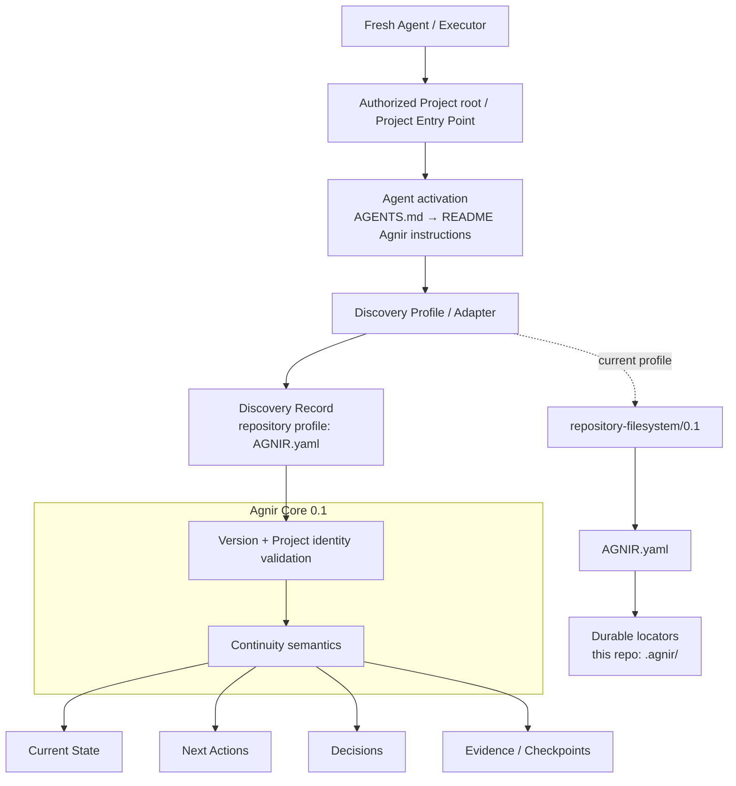
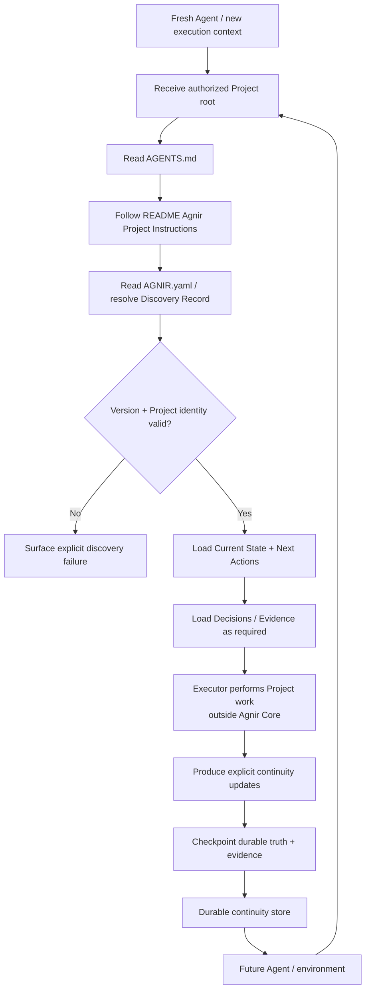

# Agnir

**English** | [简体中文](README.zh-CN.md)

Agnir is a **project-owned durable continuity protocol**.

It exists so a Project can be safely resumed when Executors, execution environments, storage implementations, or conversational contexts change. The Project owns the durable continuity; execution surfaces do not.

## 30-second Quick Start

If your Agent can read and write the Project directory, `repository-filesystem/0.1` does **not** require a daemon, account, GitHub integration, ChatGPT, or another special execution surface.

### Existing Agnir Project

**No recurring Agnir prompt is required.** A correctly initialized Agent-operable Project persistently teaches future Agents how to activate Agnir:

```text
Project root
→ AGENTS.md
→ README.md / Agnir Project Instructions
→ AGNIR.yaml
→ durable state
```

Give the Agent normal access to the Project and start your actual task. If an execution surface does not automatically inspect `AGENTS.md` or Project documentation, configure that surface once to honor Project instruction files; do not make users repeat the Agnir bootstrap prompt on every session.

### Initialize Agnir in a new Project

The initialization request must be self-contained because the Agent may know nothing about Agnir. You can paste this:

```text
Agnir is a project-owned durable continuity protocol: Project state needed for safe continuation must survive changes of Agent, conversation, execution environment, or storage implementation.

Initialize this Project for Agnir Core 0.1 using repository-filesystem/0.1.

Requirements:
1. Treat this Project root as the authorized Project Entry Point.
2. Create or validate top-level AGNIR.yaml with agnir.version "0.1", discovery_profile "repository-filesystem/0.1", a durable project.identity, and locators for Current State, Next Actions, Decisions, and Evidence. Use .agnir/state.md, .agnir/next-actions.md, .agnir/decisions.md, and .agnir/evidence/ unless the Project already has a deliberate compatible layout.
3. Create the declared durable memory with minimal current content and at least one persisted initialization evidence file.
4. In the Project's README.md, create or update a canonical section headed exactly "## Agnir Project Instructions". It must tell future Agents, before Project work, to treat the Project root as the authorized Project Entry Point, read AGNIR.yaml, load Current State and Next Actions, load Decisions and Evidence when relevant, prefer durable Agnir Project truth over chat/private Agent memory unless superseded by newer Principal instruction or directly observed current Project fact, and checkpoint material changes when saving or finishing work.
5. Create or update root AGENTS.md so it points to the README.md "Agnir Project Instructions" section. Keep AGENTS.md as a locator; do not duplicate the full Agnir rules there. Preserve unrelated existing README.md and AGENTS.md content.
6. Finish with a fresh-agent validation using only the Project root: resolve AGENTS.md → README.md Agnir Project Instructions → AGNIR.yaml → declared durable memory. Confirm continuation no longer depends on this initialization chat or your private memory.
```

The minimum manifest can look like this:

```yaml
agnir:
  version: "0.1"
  discovery_profile: "repository-filesystem/0.1"

project:
  identity: "urn:example:project:my-project"

memory:
  state: ".agnir/state.md"
  next_actions: ".agnir/next-actions.md"
  decisions: ".agnir/decisions.md"
  evidence: ".agnir/evidence/"

policy:
  checkpoint: event-driven
```

With a simple colocated layout:

```text
.agnir/
├── state.md              # current truth needed to continue safely
├── next-actions.md       # outstanding work, priorities, blockers
├── decisions.md          # durable accepted decisions and rationale
└── evidence/
    └── initialization.md # first persisted initialization evidence
```

The key property is **initialize once, resume without re-explaining Agnir**. Durable memory is incomplete as a user workflow if future Agents cannot also durably discover that they must load it.

## Agnir Project Instructions

This repository itself uses Agnir for durable Project continuity.

Before doing Project work, treat this repository root as the authorized Project Entry Point. Read top-level `AGNIR.yaml`, then load Current State and Next Actions. Load Decisions and Evidence when relevant. Prefer durable Agnir Project truth over chat history or private Agent memory unless a newer Principal instruction or directly observed current Project fact supersedes it.

When checkpointing, saving progress, or finishing work, reconcile material changes to state, next actions, decisions, and necessary evidence into the locations declared by `AGNIR.yaml`. After initialization or material discovery repair, verify the Project can cold-start again from the same Project Entry Point.

Root `AGENTS.md` is intentionally only a locator to this section; this section is the canonical activation instruction.

## Architecture Diagram



The `AGENTS.md → README` activation route is a repository/filesystem convention for Agent-operable Projects, not an Agnir Core dependency. An Executor or adapter that already knows the applicable profile may begin directly at `AGNIR.yaml`.

Agnir Core defines durable continuity semantics and discovery invariants; it does **not** require Git, GitHub, a repository, ChatGPT, an AI Agent, or any specific storage backend. Profiles/adapters realize those semantics for a concrete Project Entry Point and storage environment.

For this repository, the active realization is `repository-filesystem/0.1`: a general-purpose Agent first resolves the durable Project instruction route, then discovery resolves top-level `AGNIR.yaml`, validates Project identity and the Agnir line, and follows the declared memory locators. `AGENTS.md`, `README.md`, `AGNIR.yaml`, and `.agnir/` are profile/repository choices, not universal Core requirements.

## Continuity Flow



Agnir does not perform the Project work shown in the middle of the flow. It makes both the continuity and, for Agent-operable repository Projects, the route that activates that continuity durable. Discovery failures such as not-found, ambiguity, unsupported version, Project mismatch, authorization failure, cycles, stale locators, and material inconsistency must be surfaced rather than silently repaired by guessing.

## Active line

`main` is the stable Agnir `0.1.0` release line. The protocol compatibility identifiers remain Core `0.1` and `repository-filesystem/0.1`; repository SemVer is tracked separately in `VERSION`.

Predecessor PPMP v2.0.0 / Persistent Project Memory / Sandminni history is referenced by immutable commit SHA and the documents under `history/`; no live legacy branch or predecessor bootstrap path is part of the active protocol contract.

## Release status

The current repository is being finalized for publication as Agnir `0.1.0`. `RELEASE.md` defines the frozen version model, release scope, publication gate, and known limitation. Creating the `v0.1.0` Git tag or GitHub Release remains a separate publication action.

Version layers are intentionally distinct:

- Core compatibility: `0.1`;
- repository/filesystem profile compatibility: `repository-filesystem/0.1`;
- repository release: `0.1.0`.

## Repository Structure

This tree is the practical map of the repository. It shows the directories and key files that explain where current protocol definition, discovery profiles, executable conformance, Project continuity, activation instructions, and predecessor history live.

```text
agnir/
├── spec/                              # active protocol-level definitions; storage and execution surface remain abstract
│   ├── AGNIR_CORE.md                  # stable Core 0.1 continuity semantics and invariants
│   └── AGNIR_DISCOVERY.md             # cold-start discovery, Locator Chain, identity, and failure semantics
│
├── profiles/                          # concrete discovery/storage realizations layered outside Core
│   └── REPOSITORY_FILESYSTEM.md       # current repository-filesystem/0.1 profile + Agent activation/init contract
├── schemas/                           # machine-readable serializations for concrete profile artifacts
│   └── agnir-manifest.schema.json     # JSON Schema for this profile's AGNIR.yaml manifest
│
├── conformance/                       # executable pressure proving current Core/profile semantics
│   ├── check_agnir_0_1.py             # self-hosting cold-start and release-readiness structure check
│   ├── activation_reference.py        # conformance-only AGENTS → README activation resolver
│   ├── *_reference.py                 # other conformance-only executable reference models
│   └── test_*.py                      # activation, failure, backend, authorization, isolation, boundary fixtures
│
├── .agnir/                            # this Agnir Project's own canonical durable continuity
│   ├── state.md                       # current Project state
│   ├── next-actions.md                # next durable work to resume
│   ├── decisions.md                   # durable protocol/project decisions and rationale
│   └── evidence/                      # checkpoint and conformance evidence records
│
├── history/                           # predecessor lineage and optional historical guidance; not active Core
│   ├── PREDECESSOR.md                 # predecessor boundary referenced by immutable commit SHA
│   ├── MIGRATION_PPMP_V2.md           # optional historical migration guide; not Core/conformance/release gate
│   └── BRANCH_ARCHIVE.md              # retired branch names and final tip SHAs; main-only governance record
├── .github/workflows/                 # CI that runs self-hosting and executable conformance
├── AGENTS.md                          # Agent-facing locator to README canonical Agnir Project Instructions
├── AGNIR.yaml                         # repository-filesystem discovery anchor; not a universal Core requirement
├── RELEASE.md                         # stable release version model, scope, known limitation, publication gate
├── README.md                          # English entry point + canonical Agnir activation instructions for this repo
├── README.zh-CN.md                    # Simplified Chinese project entry point
└── VERSION                            # repository SemVer; currently 0.1.0
```

For the fully expanded file-by-file map of the current `main`, including responsibility annotations for every tracked file, see **[REPOSITORY_TREE.md](REPOSITORY_TREE.md)**.

Predecessor implementation/backend/adapter/site/template material is deliberately absent from active `main`; historical material is recoverable through `history/` and Git history. `history/` is archival/reference material and does not define current Agnir Core behavior.

## Core memory semantics

Agnir requires durable recovery of Current State, Next Actions, Decisions, and Evidence / Checkpoints.

A fresh Executor given only an authorized Project Entry Point and the applicable profile/adapter implementation must be able to resolve the Project's Discovery Record and required durable state without replaying predecessor-private context. For a general-purpose Agent that does not already know Agnir applies, the repository activation route supplies that missing durable entry instruction.

## Svif relationship

Svif is a separate **Project orchestration product** at `iorLab/svif`. Svif currently uses Agnir as its founding Continuity Provider through an Agnir adapter, but Agnir remains independently useful without Svif. Svif-specific execution, delivery, provider, authority, or distribution semantics do not belong in Agnir Core.

## Documentation synchronization

`README.md` and `README.zh-CN.md` are maintained as parallel entry points. Any change to Agnir's layer model, activation path, discovery path, durable-memory semantics, Project boundary, or continuity flow **must update the affected README diagrams in both language versions in the same change set**.

The README must keep the operational Quick Start before architecture material. For Agent-operable repository initialization, README must also document the persistent activation route and self-contained initialization contract. The plain-text **Repository Structure** tree remains a compact navigation view. The exhaustive companion **`REPOSITORY_TREE.md`** is the file-level map of the active repository and must be updated whenever tracked files are added, removed, moved, or materially change responsibility. If the change affects the compact tree, both README language versions must update it in the same change set as well.

## Conformance

Run the self-hosting structural check and the full executable pressure suite with:

```bash
python conformance/check_agnir_0_1.py
python -m unittest discover -s conformance -p 'test_*.py' -v
```

The stable `0.1.0` suite covers prompt-free Agent activation for the repository profile, repository/filesystem cold start and explicit discovery failures, a durable non-repository SQLite realization, external-memory authorization without plaintext credentials, multi-project isolation with locator-only registry metadata, generic Locator Chain cycle/stale/inconsistency semantics, symlink boundary behavior, and real Git worktree cold start.

A real mount-boundary case remains intentionally unproven until a mount-capable test environment is available; Agnir does not treat an ordinary directory as fake mount evidence. This limitation is documented in `RELEASE.md` and is not represented as proven coverage.
