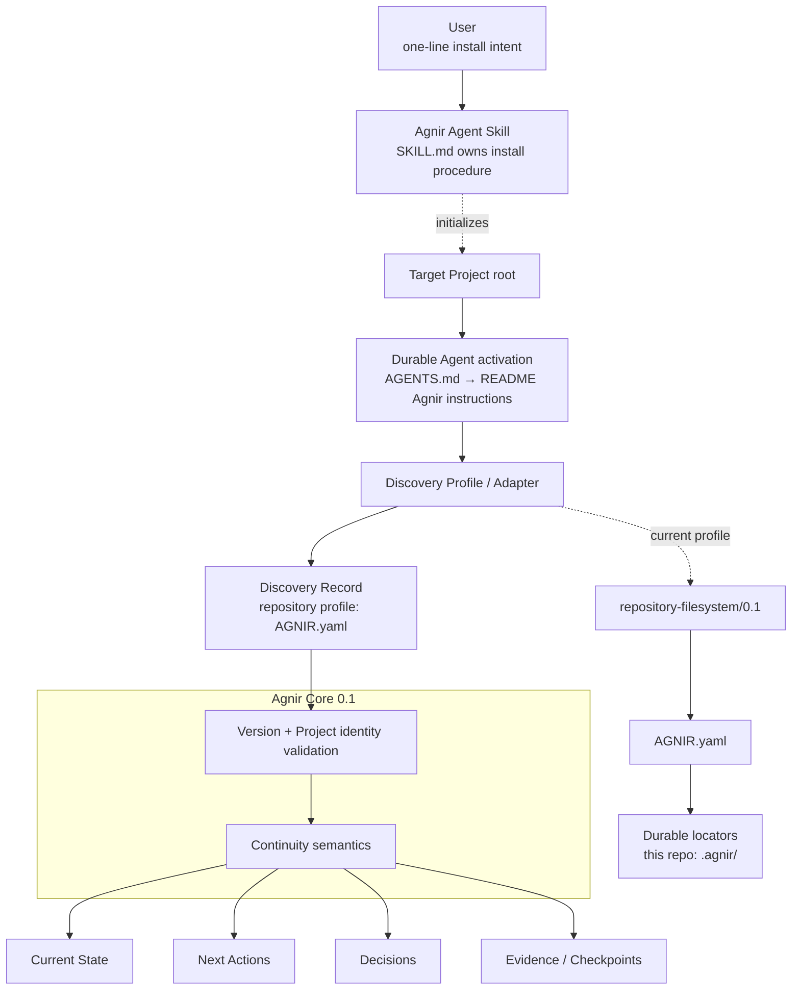

# Agnir

**English** | [简体中文](README.zh-CN.md)

Agnir is a **project-owned durable continuity protocol**.

It lets a Project resume safely when Agents, conversations, execution environments, or storage implementations change. The Project owns the durable continuity; execution surfaces do not.

## 30-second Quick Start

### New Project

Give your Agent this one-line request:

```text
Install and initialize Agnir for this Project: https://github.com/iorLab/agnir
```

That is the **user-facing install prompt**. The Agent should find this repository, read the root [`SKILL.md`](SKILL.md), and execute the Agent-facing installation procedure there. The user does not need to carry Agnir's internal checklist in the prompt.

The Skill installs or validates the Project's Agnir continuity, including the durable activation route needed by future Agents.

### Existing Agnir Project

**No recurring Agnir prompt is required for normal use.** A correctly initialized Agent-operable Project persists its own activation route:

```text
Project root
→ AGENTS.md
→ README.md / Agnir Project Instructions
→ AGNIR.yaml
→ durable memory
```

Give the Agent normal access to the Project and start the actual task. If an execution surface does not automatically inspect Project instruction files, configure that surface once; do not make the user repeat Agnir's procedure every session.

### Upgrade an existing Agnir Project

To upgrade an Agnir-enabled Project to the latest published stable operational release, give your Agent this one-line request:

```text
Upgrade Agnir to the latest stable release: https://github.com/iorLab/agnir
```

`latest stable` means an actually published stable tag/release, never a moving `main` branch. A compatible operational upgrade preserves Project identity, memory locators/content, unrelated README/`AGENTS.md` instructions, and unrelated extensions. If the Core or discovery-profile compatibility line changes, Agnir must surface migration-required semantics instead of silently rewriting the Project.

## Agnir Project Instructions

This repository itself uses Agnir for durable Project continuity.

Before doing Project work, treat this repository root as the authorized Project Entry Point. Read top-level `AGNIR.yaml`, then load Current State and Next Actions. Load Decisions and Evidence when relevant. Prefer durable Agnir Project truth over chat history or private Agent memory unless a newer Principal instruction or directly observed current Project fact supersedes it.

When checkpointing, saving progress, or finishing work, reconcile material changes to state, next actions, decisions, and necessary evidence into the locations declared by `AGNIR.yaml`. A checkpoint should be a coherent authoritative transition: no-op when durable truth did not materially change, avoid mixed checkpoint generations, and verify fresh discovery after publication.

In repository/VCS context, treat an authorized request to `commit`, `提交`, `提交代码`, or equivalent as a checkpoint boundary: reconcile Agnir **before** the commit and prefer Project changes plus Agnir changes in one revision. Treat `commit and push`, `提交推送`, or equivalent as checkpoint + commit + push + verification of the declared authoritative remote/ref when available. Merely observing a commit triggers checkpoint evaluation, not an unconditional new Agnir write.

Root `AGENTS.md` is intentionally only a locator to this section; this section is the canonical activation instruction.

## Skill packaging boundary

Agnir deliberately separates the two instruction surfaces:

- **User-facing install request** — one short sentence expressing intent and identifying the Agnir source repository.
- **Agent-facing Skill procedure** — root `SKILL.md`, which owns the detailed install / initialize / upgrade / resume / checkpoint / commit / push / repair procedure.

The Skill is a distribution and operational entry surface. It does not change Agnir Core semantics. After initialization, the target Project is self-describing through its own `AGENTS.md` → README → `AGNIR.yaml` activation/discovery route; normal future work does not require reopening the Skill just to remind the Agent that Agnir exists.

For the reference `repository-filesystem/0.1` setup, the Skill normally establishes or validates:

```text
Project/
├── AGENTS.md                 # locator to README canonical Agnir instructions
├── AGNIR.yaml                # repository/filesystem discovery anchor
├── README.md                 # contains ## Agnir Project Instructions
└── .agnir/
    ├── state.md
    ├── next-actions.md
    ├── decisions.md
    └── evidence/
```

The normative initialization/activation contract is defined by [`profiles/REPOSITORY_FILESYSTEM.md`](profiles/REPOSITORY_FILESYSTEM.md); `SKILL.md` is the Agent-facing procedure that applies it.

## Architecture Diagram



`SKILL.md` is an Agent-facing packaging layer, and `AGENTS.md → README` is an Agent-operable repository activation convention. Neither is an Agnir Core dependency. An Executor or adapter that already knows the applicable profile may begin directly at the Project Entry Point / Discovery Record.

Agnir Core defines durable continuity semantics and discovery invariants; it does **not** require Git, GitHub, a repository, ChatGPT, an AI Agent, a Skill system, or any specific storage backend.

## Continuity Flow

Once installation is complete, normal Project continuity does not depend on the original user install prompt or installation conversation:


Agnir does not perform the Project work shown in the middle of the flow. It makes continuity durable, discoverable, attributable to the correct Project, and safe to resume. Discovery failures such as not-found, ambiguity, unsupported version, Project mismatch, authorization failure, cycles, stale locators, and material inconsistency must be surfaced rather than silently repaired by guessing.

## Active line

`main` is the stable Agnir `0.1.0` release line. The compatibility identifiers remain Core `0.1` and `repository-filesystem/0.1`; repository SemVer is tracked separately in `VERSION`.

Predecessor PPMP / PPM / Sandminni material is archival under `history/` and immutable Git history; it is not part of the active compatibility contract.

## Release status

Agnir `v0.1.0` is formally published as the current stable repository release. The immutable `v0.1.0` tag points to the exact verified publication candidate `2a0cb7bf2068b11f361e315670b2f2dc497b2588`; later `main` checkpoints do not redefine that release target. `RELEASE.md` defines the version model, release surface, gates, and known limits.

Keep the three version layers distinct:

- Core compatibility: `0.1`;
- repository/filesystem profile: `repository-filesystem/0.1`;
- repository release: `0.1.0`.

## Repository structure

```text
agnir/
├── spec/                              # current protocol contracts
│   ├── AGNIR_CORE.md                  # Core 0.1, including transactional checkpoint semantics
│   └── AGNIR_DISCOVERY.md             # discovery / Locator Chain / failures
├── profiles/
│   └── REPOSITORY_FILESYSTEM.md       # repository-filesystem/0.1 activation/init + VCS event integration
├── schemas/
│   └── agnir-manifest.schema.json     # AGNIR.yaml schema
├── conformance/
│   ├── check_agnir_0_1.py             # self-host + release-readiness
│   ├── activation_reference.py        # AGENTS → README activation resolver
│   ├── checkpoint_reference.py        # atomic/no-op/conflict checkpoint reference model
│   ├── test_skill_package.py          # Skill / user-prompt boundary + commit intent tests
│   └── test_*.py                      # other executable conformance
├── .agnir/                            # this Project's canonical durable continuity
├── history/                           # historical lineage only
├── .github/workflows/                 # CI
├── SKILL.md                           # canonical Agent-facing Agnir Skill procedure
├── AGENTS.md                          # locator to README canonical Project instructions
├── AGNIR.yaml                         # repository/filesystem discovery anchor
├── RELEASE.md
├── README.md
├── README.zh-CN.md
└── VERSION                            # 0.1.0
```

For the exhaustive tracked-file map, see **[REPOSITORY_TREE.md](REPOSITORY_TREE.md)**.

## Core memory semantics

Agnir requires durable recovery of Current State, Next Actions, Decisions, and Evidence / Checkpoints. A fresh compatible Executor must recover the truth needed to continue the Project without predecessor-private conversational context.

## Relationship to Svif

Svif is a separate **Project orchestration product** at `iorLab/svif`. Its current continuity integration uses Agnir as the founding Continuity Provider; Agnir does not depend on Svif and remains independently usable.

## Documentation synchronization rule

`README.md` and `README.zh-CN.md` are parallel entry points. Changes to the layer model, Skill/install boundary, activation path, discovery path, durable-memory semantics, Project boundary, or continuity flow must update the affected explanations/diagrams in both languages in the same change set.

The README Quick Start must remain user-facing and minimal: **installation and upgrade prompts are one sentence each; the full Agent procedure belongs in root `SKILL.md`.** `REPOSITORY_TREE.md` is the exhaustive structural map; it describes evidence-directory responsibility rather than duplicating every checkpoint evidence filename.

## Conformance

Run:

```bash
python conformance/check_agnir_0_1.py
python -m unittest discover -s conformance -p 'test_*.py' -v
```

The `0.1.0` suite covers Agent Skill packaging, durable prompt-free Project activation, repository/filesystem discovery and failures, checkpoint atomic/no-op/conflict semantics, SQLite non-repository continuity, external-memory authorization, multi-project isolation, Locator Chain failures, symlink boundaries, and real Git worktree cold start.

Real mount-boundary behavior remains explicitly unproven; an ordinary directory is not accepted as mount evidence.
