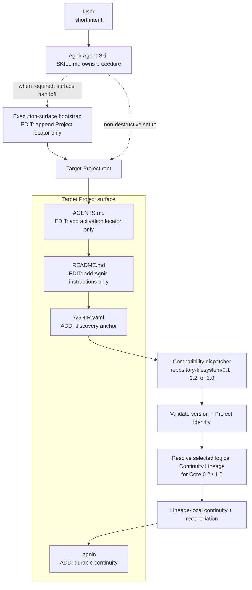
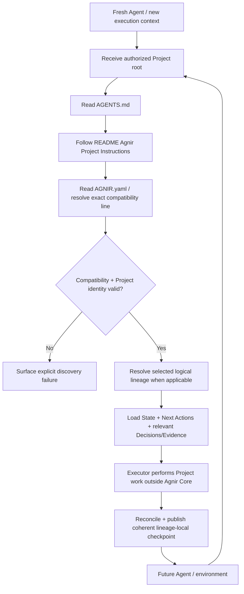

# Agnir

**English** | [简体中文](README.zh-CN.md)

Agnir is a **project-owned durable continuity protocol**. It lets a Project resume safely when Agents, conversations, execution environments, storage implementations, or parallel work contexts change. The Project owns durable continuity; execution surfaces and backend selectors do not.

**Name.** `Agnir` is taken from Icelandic `agnir`, the nominative plural of `ögn`, meaning a tiny bit or particle. Durable continuity is assembled from small discoverable pieces of Project truth: Current State, Next Actions, Decisions, and Evidence.

## Start Here

This section is for users. Give the Agent only the intent you actually want.

### Install Agnir in a new Project

```text
Install and initialize Agnir for this Project: https://github.com/iorLab/agnir
```

### Upgrade an existing Agnir Project

```text
Upgrade Agnir to the latest stable release: https://github.com/iorLab/agnir
```

### Continue normal work

**No recurring Agnir prompt is required.** Give the Agent access to the Project and ask for the real task.

Some execution surfaces need a **one-time persistent Project locator** before a fresh context can reach the Project's own activation route. During install or upgrade, the Agnir Skill must configure that surface when authorized and capable, or provide a **copy-ready handoff**. It must report **surface activation separately from repository activation**. This execution-surface configuration is adapter behavior, not Agnir Core or Project memory.

The **Execution-surface bootstrap** must **append Project locator only** and preserve unrelated surface instructions. For install, migration, compatibility promotion, upgrade, or repair, root [`SKILL.md`](SKILL.md) is the canonical Agent-facing procedure.

A repository Project persists its own activation route:

```text
Project root
→ AGENTS.md
→ README.md / Agnir Project Instructions
→ AGNIR.yaml
→ selected durable continuity
```

`latest stable` means an actually published non-prerelease tag/Release, never a moving `main`, temporary release branch, RC, or untagged commit. This source tree carries the repository `1.0.0` stable package. Stable-upgrade resolution advances to `v1.0.0` only after the non-prerelease `v1.0.0` Release is successfully published at the exact authoritative revision; the accepted `v1.0.0-rc.1` remains prerelease evidence only.

## Agnir Project Instructions

> **For Agents.** Users normally do not need to read this section.

1. **Discover.** Treat the repository root as the authorized Project Entry Point. Read top-level `AGNIR.yaml`; validate the declared Core/profile compatibility, Project identity, and — for Core `0.2` or `1.0` — the selected logical Continuity Lineage. Validate backend selector/binding separately from lineage identity. Dispatch according to the compatibility line actually declared.
2. **Load.** Load Current State and Next Actions from the declared selected continuity. Load Decisions and Evidence when they materially constrain the operation. Prefer durable Project truth over private conversational memory unless superseded by a newer Principal instruction or directly observed Project fact.
3. **Work.** Perform the actual Project task outside Agnir Core. Use root `SKILL.md` for install, migration, compatibility promotion, upgrade, or repair.
4. **Checkpoint.** At an intentional checkpoint, save-progress, finish, or repository **commit boundary**, reconcile only material continuity changes for the selected lineage. Unchanged durable truth is a no-op. Reject stale-base publication with `AGNIR_CHECKPOINT_CONFLICT` rather than overwriting newer truth.
5. **Commit / push.** In repository context, `commit`, `提交代码`, or equivalent intent means checkpoint before commit and preferably one revision for Project + Agnir changes. `commit and push`, `提交推送`, or equivalent adds push plus destination-ref verification.
6. **Integrate lineages safely.** For Core `0.2`/`1.0` parallel continuity, source continuity is reconciliation input, not target truth. Stage without target advancement when Agnir controls the path, reconcile target continuity against the integrated Project result, then publish integrated Project + reconciled target checkpoint coherently.

Root `AGENTS.md` is intentionally a locator to this section; it must not become a second copy of Project state or the Agnir procedure.

## What Agnir Adds to a Project

When the reference Agnir Skill initializes a repository/filesystem Project, it establishes a small Project-owned continuity surface. **Agnir does not take over existing Project files.** For `AGENTS.md` and `README.md`, the Skill adds only the Agnir entry it needs while preserving unrelated content.

```text
Project/
├── AGENTS.md                 # [EDIT: add entry only] add activation locator; preserve existing instructions
├── AGNIR.yaml                # [ADD] discovery anchor: identity, compatibility, lineage, memory locators
├── README.md                 # [EDIT: add entry only] add Agnir instructions; preserve existing content
└── .agnir/                   # [ADD] Project-owned durable continuity
    ├── state.md              # [ADD] current durable truth
    ├── next-actions.md       # [ADD] ordered outstanding work
    ├── decisions.md          # [ADD] durable decisions
    └── evidence/             # [ADD] recovery/audit/reconciliation evidence
```

Execution-surface configuration is not a Project file. `AGNIR.yaml` locators are authoritative; the `.agnir/` layout above is the recommended colocated layout for this profile, not a universal Agnir Core storage requirement.

## Architecture Diagram



`SKILL.md`, `AGENTS.md → README`, and execution-surface bootstrap are packaging/activation conventions around the Core. None is a Core dependency.

Core `0.2` made **Continuity Lineage** explicit; Core `1.0` stabilizes the independently validated same semantic model. Project identity, logical lineage identity, selector/binding, and revision receipt remain distinct.

## Skill packaging boundary

The Skill separates short user intent from the full Agent procedure. Stable install/upgrade resolves an actually published stable release. Explicit prerelease targets remain possible only with Principal authorization. The `1.0.x` distribution may continue to support Projects that declare Core/profile `0.1` or `0.2`; installing the distribution does not authorize silently rewriting those compatibility identifiers.

## Continuity Flow



Agnir does not perform the Project work. It makes continuity durable, discoverable, attributable to the correct Project/lineage, and safe to resume. Discovery failures must be surfaced rather than repaired by guessing.

## Compatibility and migration

Supported compatibility lines remain explicit:

- published `v0.1.1`: Core `0.1` + `repository-filesystem/0.1`;
- published `v0.2.0`: Core `0.2` + `repository-filesystem/0.2`;
- repository stable package `v1.0.0`: Core `1.0` + `repository-filesystem/1.0`, while historical `0.1`/`0.2` compatibility paths remain shipped and tested.

A `0.1` Project migrates explicitly to `0.2` under [`spec/CORE_0_1_TO_0_2_MIGRATION.md`](spec/CORE_0_1_TO_0_2_MIGRATION.md). Core/profile `1.0` is a **stability promotion of behavior independently validated under `0.2`**, not a feature-driven redesign. An existing `0.2` Project may remain `0.2`; changing its declaration to `1.0` is a separately authorized Project-owned promotion governed by [`spec/CORE_0_2_TO_1_0_PROMOTION.md`](spec/CORE_0_2_TO_1_0_PROMOTION.md).

## Active line and release status

**Repository stable package: `v1.0.0`** — Core `1.0` + `repository-filesystem/1.0`.

**Accepted release candidate: `v1.0.0-rc.1`** at exact revision `092945289f1a0a9803e4fe0583104aa380ceaadc`; the immutable RC cycle passed both publication and fresh-source verification.

Stable publication is a distinct authoritative-main operation. The `release/v1.0.0` staging lineage is reconciliation input only; publication may be armed only on exact authoritative `main` after full target verification.

```text
Agnir repository v1.0.0
├── Core 1.0
└── repository-filesystem/1.0
```

Existing Core/profile `0.1` and `0.2` Projects remain supported. Repository release version, Core compatibility version, profile version, logical lineage identity, selector, and revision receipt remain separate concepts.

[`RELEASE.md`](RELEASE.md) describes the stable package and exact publication invariant; [`V1_RELEASE_CRITERIA.md`](V1_RELEASE_CRITERIA.md) defines the v1 stability gate. Published tags are immutable by Project policy.

## Repository structure

```text
agnir/
├── spec/                                  # Core/discovery/migration/promotion contracts
│   ├── AGNIR_CORE.md                      # Core 0.1 compatibility
│   ├── AGNIR_CORE_0_2.md                  # stable Core 0.2
│   ├── AGNIR_CORE_1_0.md                  # stable Core 1.0
│   ├── AGNIR_DISCOVERY.md
│   ├── CORE_0_1_TO_0_2_MIGRATION.md
│   └── CORE_0_2_TO_1_0_PROMOTION.md
├── profiles/                              # repository/filesystem compatibility profiles
├── conformance/
│   ├── activation_reference.py
│   ├── checkpoint_reference.py
│   ├── check_agnir_1_0.py
│   ├── test_skill_package.py
│   └── test_*.py
├── .agnir/                                # this Project's canonical durable continuity
├── brand/                                 # approved identity system, masters, exports, references, QA
├── history/                               # predecessor/history material
├── SKILL.md                               # canonical Agent-facing procedure
├── AGENTS.md                              # locator to Project instructions
├── AGNIR.yaml                             # Project/lineage discovery anchor
├── README.md
├── README.zh-CN.md
├── REPOSITORY_TREE.md                     # exhaustive responsibility map
├── RELEASE.md                             # stable package/publication contract
├── RELEASE_MILESTONES.md
├── VERSIONING.md
└── VERSION                                # repository source-package SemVer
```

For the exhaustive tracked-file map, see **[REPOSITORY_TREE.md](REPOSITORY_TREE.md)**.

## Core memory semantics

Agnir requires durable recovery of Current State, Next Actions, Decisions, and Evidence / Checkpoints for the selected continuity. A fresh compatible Executor must recover the truth needed to continue without predecessor-private conversational context.

## Relationship to Svif

Agnir and Svif are separate products. Agnir owns durable Project continuity semantics. Svif may consume Agnir through a Continuity Provider or adapter, but Agnir does not depend on Svif.

## Scope

Agnir Core is intentionally neutral about Git, GitHub, repositories, filesystems, ChatGPT, specific Agent products, and storage engines. Repository/filesystem behavior, VCS mapping, execution-surface handoff, and Agent Skill packaging are profiles/adapters/distribution concerns built around the Core contract.
