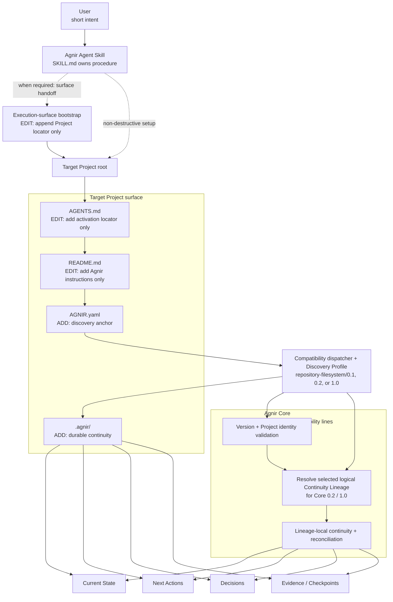
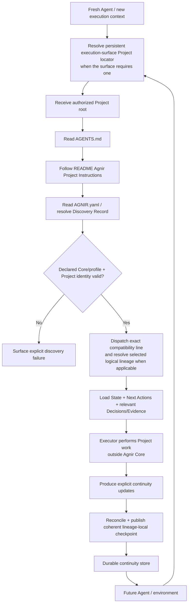

# Agnir

**English** | [简体中文](README.zh-CN.md)

Agnir is a **project-owned durable continuity protocol**.

It lets a Project resume safely when Agents, conversations, execution environments, storage implementations, or parallel work contexts change. The Project owns durable continuity; execution surfaces and backend selectors do not.

**Name.** `Agnir` is taken from Icelandic `agnir`, the nominative plural of `ögn`, meaning a tiny bit or particle. The name matches Agnir's model: durable Project continuity is composed from small, discoverable pieces of Project truth — Current State, Next Actions, Decisions, and Evidence — that together let a fresh Executor understand and resume the Project.

## Start Here

This section is for users. Pick the action you want and give the Agent only the corresponding intent.

### Install Agnir in a new Project

```text
Install and initialize Agnir for this Project: https://github.com/iorLab/agnir
```

### Upgrade an existing Agnir Project

```text
Upgrade Agnir to the latest stable release: https://github.com/iorLab/agnir
```

### Continue normal work

**No recurring Agnir prompt is required.** Give the Agent access to the Project and ask for the actual task.

Some execution surfaces need a **one-time persistent Project locator** before a fresh context can reach the Project's own activation route. During install or upgrade, the Agnir Skill must either configure that surface when it can or give the user a **copy-ready handoff**; it must report **surface activation separately from repository activation** and must not claim full activation while required execution-surface configuration is pending. This is execution-surface integration, not Agnir Core or Project memory.

For install, migration, compatibility promotion, upgrade, or repair operations, the Agent should use root [`SKILL.md`](SKILL.md) as the canonical procedure. The user does not need to carry Agnir's internal checklist.

After repository initialization and any required one-time execution-surface configuration, an Agent-operable repository Project persists its own activation route:

```text
Project root
→ AGENTS.md
→ README.md / Agnir Project Instructions
→ AGNIR.yaml
→ selected durable continuity
```

`latest stable` always means an actually published non-prerelease tag/release, never a moving `main`, temporary promotion/release branch, RC, or untagged commit. **`v0.2.0` is currently the latest published stable release.** Core/profile `1.0` is being prepared as a stability-promotion candidate; its presence in source does not make `v1.0.0` published or eligible for ordinary stable-upgrade resolution.

## Agnir Project Instructions

> **For Agents.** Users normally do not need to read this section.

1. **Discover.** Treat this repository root as the authorized Project Entry Point. Read top-level `AGNIR.yaml`; validate the declared Agnir Core/profile compatibility, Project identity, and — for Core `0.2` or `1.0` — the selected logical Continuity Lineage. If a backend selector/binding is present, validate it separately from lineage identity. Dispatch according to the compatibility line actually declared; do not silently reinterpret a valid older line as a newer one.
2. **Load.** Load Current State and Next Actions from the declared selected continuity. Load Decisions and Evidence when they materially constrain the current operation. Prefer durable Project truth over chat history or private Agent memory unless superseded by a newer Principal instruction or a directly observed current Project fact.
3. **Work.** Perform the actual Project task outside Agnir Core. For install, migration, compatibility promotion, upgrade, or repair operations, root `SKILL.md` is the canonical Agent-facing procedure.
4. **Checkpoint.** At an intentional checkpoint, save-progress, finish, or repository **commit boundary**, reconcile only material continuity changes for the selected lineage. Unchanged durable truth is a no-op. Material changes must form one coherent authoritative transition; reject stale-base publication with `AGNIR_CHECKPOINT_CONFLICT` rather than overwriting newer truth, then verify fresh discovery after publication.
5. **Commit / push.** In repository/VCS context, authorized `commit`, `提交`, `提交代码`, or equivalent intent means checkpoint before commit and preferably one revision for Project + Agnir changes. `commit and push`, `提交推送`, or equivalent adds push plus verification of the actual destination ref. A claim of authoritative publication additionally requires the declared authoritative ref when one exists. Merely observing an external commit triggers checkpoint evaluation, not an unconditional Agnir write.
6. **Integrate lineages safely.** For Core `0.2`/`1.0` parallel continuity, source continuity is reconciliation input, not target truth. Stage integration without advancing the target when Agnir controls the path, reconcile target continuity against the actual integrated Project result, and publish the integrated Project + reconciled target checkpoint coherently.

Root `AGENTS.md` is intentionally only a locator to this section; it must not become a second copy of Project state or the Agnir procedure. The canonical activation route is:

`Project root -> AGENTS.md -> README.md / Agnir Project Instructions -> AGNIR.yaml -> declared durable memory`

If an activation locator, identity, lineage/binding, required memory locator, or compatibility check fails, surface the failure or repair the earliest faulty layer when authorized. Do not invent Project state or silently fall back to chat history, sibling repositories, sibling branches, or retired layouts.

## What Agnir Adds to a Project

When the reference Agnir Skill initializes a repository/filesystem Project, it establishes or validates a small **Project-owned continuity surface**. **Agnir does not take over existing Project files.** For `AGENTS.md` and `README.md`, the Skill only adds the Agnir entry it needs while preserving unrelated existing content; the remaining Agnir continuity artifacts are normally added as new Project-owned files.

```text
Project/
├── AGENTS.md                 # [EDIT: add entry only] add Agnir activation locator; preserve existing instructions
├── AGNIR.yaml                # [ADD] discovery anchor: Project identity, compatibility, selected lineage, memory locators
├── README.md                 # [EDIT: add entry only] add ## Agnir Project Instructions; preserve existing content
└── .agnir/                   # [ADD] Project-owned durable continuity
    ├── state.md              # [ADD] current durable truth for the selected lineage
    ├── next-actions.md       # [ADD] outstanding ordered work for the selected lineage
    ├── decisions.md          # [ADD] durable decisions that constrain future work
    └── evidence/             # [ADD] recovery/audit/reconciliation evidence and checkpoints
```

Execution-surface configuration is not a Project file and is not part of this Project-owned tree. If a surface needs one-time persistent settings — for example, ChatGPT Project Instructions — the Skill should **append Project locator only** (or ask the user to append it), preserving unrelated surface instructions. The **Execution-surface bootstrap** points to the Project; the Project's own `AGENTS.md → README → AGNIR.yaml` route remains canonical.

`AGNIR.yaml` locators are authoritative. The `.agnir/` layout above is the recommended colocated layout for this profile, not a universal Agnir Core storage requirement.

## Architecture Diagram



`SKILL.md` is an Agent-facing packaging layer, and `AGENTS.md → README` is an Agent-operable repository activation convention. Execution-surface bootstrap is a separate adapter concern: when a surface does not automatically reach the Project, it stores only enough persistent locator information to enter this route. None of these are Agnir Core dependencies.

Core `0.2` made **Continuity Lineages** explicit; Core `1.0` deliberately stabilizes the independently validated same semantic model without making Git or branch names Core concepts:

```text
Project identity
      │
      ├── logical Continuity Lineage A ── selected/bound by backend context A
      │        └── checkpoints / receipts
      │
      └── logical Continuity Lineage B ── selected/bound by backend context B
               └── checkpoints / receipts
```

For a VCS-backed Project, branch/ref/worktree is a selector/binding, **not automatically lineage identity**. A commit SHA may be a checkpoint receipt, not lineage identity. Agnir-aware lineage fork, rename/rebind, and integration must preserve these distinctions.

### Integration publication

When Agnir controls source→target lineage integration, the safe sequence is:

```text
capture target + source receipts
→ stage integrated Project candidate without target advancement
→ reconcile target continuity
→ construct target checkpoint
→ publish integrated Project + reconciled target continuity together
→ fresh-resolve target and source
```

Source State/Next Actions/Decisions/Evidence are inputs to reconciliation; they are never automatic target truth.

## Skill packaging boundary

Agnir deliberately separates user intent from Agent procedure:

- **User-facing requests** stay short: install, upgrade, or continue the real task.
- **Agent-facing procedure** lives in root `SKILL.md`, which owns install / initialize / migration / compatibility promotion / upgrade / resume / checkpoint / commit / push / integration / repair behavior.

The Skill is a distribution and operational entry surface. It does not change Agnir Core semantics. After initialization, the target Project is self-describing through its own `AGENTS.md` → README → `AGNIR.yaml` activation/discovery route.

When the execution surface itself needs persistent configuration to reach the Project, the Skill treats that as a one-time surface handoff. It preserves unrelated surface instructions, keeps the handoff locator-only, and reports surface activation separately from repository activation.

For a stable install/upgrade request, the Skill resolves an actually published stable release. An explicitly authorized prerelease target may still be used, but it must never silently replace stable resolution.

A future `1.0.x` distribution may support Projects that still declare Core/profile `0.2`; installing that distribution is not permission to rewrite the Project compatibility identifiers. Explicit `0.2` → `1.0` promotion is separate Project-owned compatibility work.

## Continuity Flow

Once installation and any required one-time execution-surface configuration are complete, normal Project continuity does not depend on the original installation conversation:



Agnir does not perform the Project work shown in the middle of the flow. It makes continuity durable, discoverable, attributable to the correct Project and selected lineage, and safe to resume. Discovery failures such as not-found, ambiguity, unsupported version, Project mismatch, authorization failure, lineage/binding failure, cycles, stale locators, and material inconsistency must be surfaced rather than silently repaired by guessing.

## Compatibility and migration

Core/profile compatibility lines are explicit contracts:

- published `v0.1.1` uses Core `0.1` + `repository-filesystem/0.1`;
- published `v0.2.0` uses stable Core `0.2` + `repository-filesystem/0.2`;
- the intended `v1.0.0` line aligns the product with stable Core `1.0` + `repository-filesystem/1.0`, while continuing to support historical `0.1`/`0.2` compatibility paths.

A `0.1` Project's single implicit continuity line migrates to exactly one initial/default `0.2` logical lineage. Migration preserves `project.identity`, durable continuity, and applicable memory locators; it is not silently reclassified as an operational upgrade. See [`spec/CORE_0_1_TO_0_2_MIGRATION.md`](spec/CORE_0_1_TO_0_2_MIGRATION.md).

Core/profile `1.0` is a **stability promotion of the behavior independently validated under `0.2`**, not a feature-driven redesign. A fresh 1.0 Project uses `agnir.version: "1.0"` and `repository-filesystem/1.0`. An existing valid `0.2` Project may remain `0.2`; a distribution that supports both lines dispatches each Project according to the compatibility identifiers it actually declares.

If an existing Project intentionally changes its declaration from `0.2` to `1.0`, that is an explicit compatibility-promotion boundary. It requires authorization, preserves Project identity and logical lineage identity exactly, preserves durable memory/locators/policy/extensions/unrelated Project content, rejects stale publication, and fresh-resolves exact 1.0. See [`spec/CORE_0_2_TO_1_0_PROMOTION.md`](spec/CORE_0_2_TO_1_0_PROMOTION.md).

Core/profile `0.1` and `0.2` contracts and conformance remain in the repository as supported compatibility and migration surfaces; their historical normative files are not rewritten as 1.0.

## Active line and release status

**Published stable:** repository `v0.2.0`, Core `0.2`, `repository-filesystem/0.2`.

**Promotion candidate in development:** repository `v1.0.0` alignment with Core `1.0` + `repository-filesystem/1.0`. The independent-implementation gate for the proven 0.2 behavior is satisfied; the 1.0 candidate must still complete promotion/package/release gates and an explicit `1.0.0-rc` cycle before stable publication.

The target stable version alignment is:

```text
Agnir repository v1.0.0
├── Core 1.0
└── repository-filesystem/1.0
```

Existing Core/profile `0.2` Projects remain supported; they are not forced to rewrite merely because a 1.0 distribution exists.

The release/promotion branch uses its own logical lineage and selector binding; authoritative `main` uses `urn:agnir:lineage:authoritative`. These lineage identities remain separate from branch names.

Keep the version layers distinct:

- current published repository release: `0.2.0`;
- current published primary Core/profile line: Core `0.2` / `repository-filesystem/0.2`;
- 1.0 promotion candidate: Core `1.0` / `repository-filesystem/1.0`;
- future repository stable target after RC acceptance: `1.0.0`.

[`RELEASE.md`](RELEASE.md) records the currently published stable `v0.2.0` contract/evidence; [`V1_RELEASE_CRITERIA.md`](V1_RELEASE_CRITERIA.md) defines the additional v1 gate. Published tags are immutable by Project policy.

## Repository structure

```text
agnir/
├── spec/                                  # protocol contracts and migration/promotion
│   ├── AGNIR_CORE.md                      # Core 0.1 compatibility contract
│   ├── AGNIR_CORE_0_2.md                  # stable Core 0.2 normative contract
│   ├── AGNIR_CORE_1_0.md                  # Core 1.0 stability-promotion contract
│   ├── AGNIR_DISCOVERY.md                 # discovery / Locator Chain / failures
│   ├── CORE_0_1_TO_0_2_MIGRATION.md       # explicit 0.1 -> 0.2 compatibility migration
│   └── CORE_0_2_TO_1_0_PROMOTION.md       # explicit semantics-preserving 0.2 -> 1.0 promotion
├── profiles/
│   ├── REPOSITORY_FILESYSTEM.md           # repository-filesystem/0.1
│   ├── REPOSITORY_FILESYSTEM_0_2.md       # stable repository-filesystem/0.2
│   ├── REPOSITORY_FILESYSTEM_1_0.md       # repository-filesystem/1.0 stability contract
│   └── VCS_BRANCH_CONTINUITY.md           # legacy Core/profile 0.1 VCS extension material
├── schemas/                               # 0.1 + 0.2 + 1.0 manifest schemas
├── conformance/
│   ├── check_agnir_0_1.py                 # Core/profile 0.1 compatibility helpers
│   ├── check_agnir_0_2.py                 # published Core/profile 0.2 self-host gate
│   ├── core_1_0_reference.py              # Core 1.0 stability reference surface
│   ├── repository_filesystem_1_0_reference.py
│   ├── repository_filesystem_1_0_promotion_reference.py
│   ├── activation_reference.py            # AGENTS → README activation resolver
│   ├── checkpoint_reference.py            # coherent/no-op/conflict checkpoint model
│   ├── test_skill_package.py              # Skill / user-UX / handoff pressure
│   ├── test_repository_filesystem_1_0.py  # exact 1.0 discovery/failure pressure
│   ├── test_repository_filesystem_1_0_promotion.py
│   ├── test_stable_release_gates.py       # current stable package/install/migration pressure
│   └── test_*.py                          # backend, lineage, migration, integration pressure
├── .agnir/                                # this Project's canonical durable continuity
├── history/                               # historical predecessor material
├── .github/                               # CI workflows
├── SKILL.md                               # canonical Agent-facing procedure
├── AGENTS.md                              # locator to README Project instructions
├── AGNIR.yaml                             # selected Project/lineage discovery anchor
├── README.md
├── README.zh-CN.md
├── REPOSITORY_TREE.md                     # exhaustive tracked-file responsibility map
├── RELEASE.md                             # currently published stable release contract/evidence
├── RELEASE_MILESTONES.md                  # release progression and stability target
├── VERSIONING.md                          # repository/Core/profile compatibility policy
└── VERSION                                # currently published repository SemVer
```

For the exhaustive tracked-file map, see **[REPOSITORY_TREE.md](REPOSITORY_TREE.md)**.

## Core memory semantics

Agnir requires durable recovery of Current State, Next Actions, Decisions, and Evidence / Checkpoints for the selected continuity. A fresh compatible Executor must recover the truth needed to continue the Project without predecessor-private conversational context.

## Relationship to Svif

Agnir and Svif are separate products. Agnir owns durable Project continuity semantics. Svif may consume Agnir through a Continuity Provider or adapter, but Agnir does not depend on Svif.

## Scope

Agnir Core is intentionally neutral about Git, GitHub, repositories, filesystems, ChatGPT, specific Agent products, and storage engines. Repository/filesystem behavior, VCS mapping, execution-surface handoff, and Agent Skill packaging are profiles/adapters/distribution concerns built around the Core contract.
