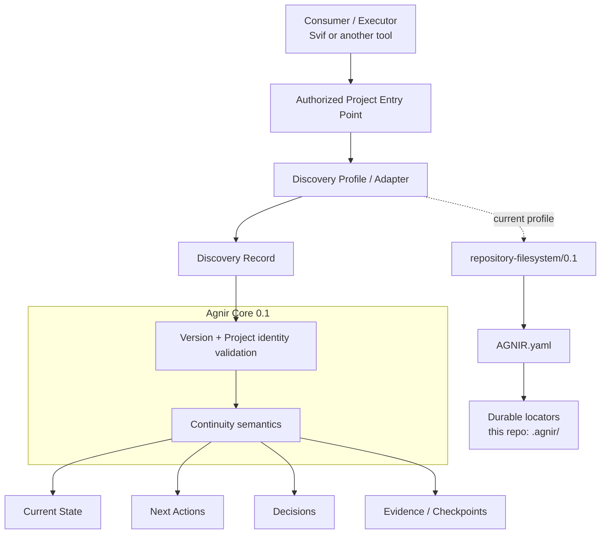
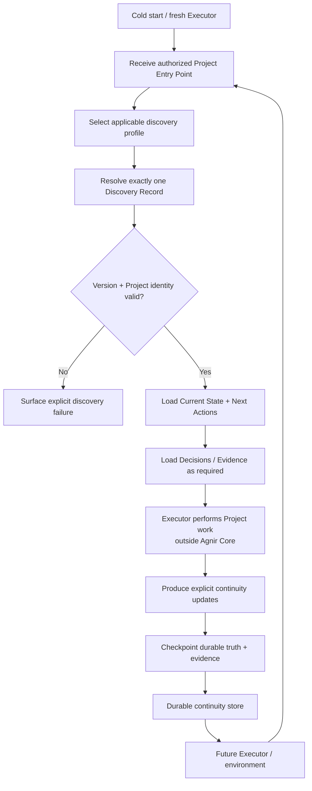

# Agnir

**English** | [简体中文](README.zh-CN.md)

Agnir is a **project-owned durable continuity protocol**.

It exists so a Project can be safely resumed when Executors, execution environments, storage implementations, or conversational contexts change. The Project owns the durable continuity; execution surfaces do not.

## Architecture Diagram



Agnir Core defines durable continuity semantics and discovery invariants; it does **not** require Git, GitHub, a repository, ChatGPT, or any specific storage backend. Profiles/adapters realize those semantics for a concrete Project Entry Point and storage environment.

For this repository, the active realization is `repository-filesystem/0.1`: cold start begins at the Project root, resolves top-level `AGNIR.yaml`, validates the Project identity and Agnir line, then follows the declared memory locators. `AGNIR.yaml` and `.agnir/` are profile/repository choices, not universal Core requirements.

## Continuity Flow



Agnir does not perform the Project work shown in the middle of the flow. It makes the before/after continuity durable, discoverable, attributable to the correct Project, and safe to resume. Discovery failures such as not-found, ambiguity, unsupported version, Project mismatch, authorization failure, cycles, stale locators, and material inconsistency must be surfaced rather than silently repaired by guessing.

## Active line

`main` is the Agnir Core `0.1` **release-candidate line**. The repository version is currently `0.1.0-rc.1`. The released predecessor PPMP v2.0.0 / Persistent Project Memory / Sandminni line is preserved on `legacy/ppmp-v2.0.0` and is not silently relabeled as Agnir.

## Versioning

The protocol compatibility line and repository release version are deliberately separate:

- Discovery Records use `agnir.version: "0.1"` for Core compatibility;
- the current filesystem profile is `repository-filesystem/0.1`;
- repository/distribution releases use SemVer, with the first stable release of this line being `0.1.0`.

Patch releases in `0.1.x` may clarify or strengthen conformance but must not redefine existing Core `0.1` semantics. A breaking Core change requires a new compatibility line such as `"0.2"`.

## Repository Structure

This tree is the practical map of the repository. It shows the directories and key files that explain where protocol definition, discovery profiles, executable conformance, Project continuity, and predecessor history live.

```text
agnir/
├── spec/                              # protocol-level definitions; storage and execution surface remain abstract
│   ├── AGNIR_CORE.md                  # Core 0.1 continuity semantics and invariants
│   ├── AGNIR_DISCOVERY.md             # cold-start discovery, Locator Chain, identity, and failure semantics
│   └── MIGRATION_PPMP_V2.md           # explicit predecessor-to-Agnir migration requirements
│
├── profiles/                          # concrete discovery/storage realizations layered outside Core
│   └── REPOSITORY_FILESYSTEM.md       # current repository-filesystem/0.1 profile
├── schemas/                           # machine-readable serializations for concrete profile artifacts
│   └── agnir-manifest.schema.json     # JSON Schema for this profile's AGNIR.yaml manifest
│
├── conformance/                       # executable pressure proving the Core/profile semantics
│   ├── check_agnir_0_1.py             # self-hosting cold-start and active-repository structure check
│   ├── *_reference.py                 # conformance-only executable reference models; not production implementations
│   └── test_*.py                      # failure, backend, authorization, isolation, migration, and boundary fixtures
│
├── .agnir/                            # this Agnir Project's own canonical durable continuity
│   ├── state.md                       # current Project state
│   ├── next-actions.md                # next durable work to resume
│   ├── decisions.md                   # durable protocol/project decisions and rationale
│   └── evidence/                      # checkpoint and conformance evidence records
│
├── history/                           # predecessor lineage retained as history, not active protocol structure
│   └── PREDECESSOR.md                 # pointer to PPMP / Persistent Project Memory / Sandminni lineage
├── .github/workflows/                 # CI that runs self-hosting and executable conformance
├── AGNIR.yaml                         # this repository's repository-filesystem discovery anchor; not a universal Core requirement
├── README.md                          # English project entry point
├── README.zh-CN.md                    # Simplified Chinese project entry point
└── VERSION                            # repository release version; currently 0.1.0-rc.1
```

For the fully expanded file-by-file map of the current `main`, including responsibility annotations for every tracked file, see **[REPOSITORY_TREE.md](REPOSITORY_TREE.md)**.

Predecessor implementation/backend/adapter/site/template material is deliberately absent from active `main`; it remains available on the legacy branch.

## Core memory semantics

Agnir requires durable recovery of Current State, Next Actions, Decisions, and Evidence / Checkpoints.

A fresh Executor given only an authorized Project Entry Point must be able to resolve the Project's Discovery Record and required durable state without replaying predecessor-private context.

## Svif relationship

Svif is a separate **Project orchestration product** at `iorLab/svif`. Svif currently uses Agnir as its founding Continuity Provider through an Agnir adapter, but Agnir remains independently useful without Svif. Svif-specific execution, delivery, provider, authority, or distribution semantics do not belong in Agnir Core.

## Documentation synchronization

`README.md` and `README.zh-CN.md` are maintained as parallel entry points. Any change to Agnir's layer model, discovery path, durable-memory semantics, Project boundary, or continuity flow **must update the affected README diagrams in both language versions in the same change set**. The diagrams represent the current architecture and flow.

The plain-text **Repository Structure** tree remains a compact navigation view. The exhaustive companion **`REPOSITORY_TREE.md`** is the file-level map of the active repository and must be updated whenever tracked files are added, removed, moved, or materially change responsibility. If the change affects the compact tree, both README language versions must update it in the same change set as well.

## Conformance

Run the self-hosting structural check and the full executable pressure suite with:

```bash
python conformance/check_agnir_0_1.py
python -m unittest discover -s conformance -p 'test_*.py' -v
```

The suite currently covers repository/filesystem cold start and all explicit discovery failures, durable non-repository SQLite continuity, external-memory authorization without plaintext credentials, multi-project isolation with locator-only registry metadata, generic Locator Chain cycle/stale/inconsistency semantics, symlink boundaries, real Git worktree cold start, and exact PPMP v2 -> Agnir migration. The PPMP fixture is aligned with the canonical `legacy/ppmp-v2.0.0` manifest, preserves material state / next actions / decisions / checkpoint evidence, cold-starts the migrated target through current Agnir discovery, and explicitly rejects v1/RPM serialization as PPMP v2.

A real mount-boundary case remains intentionally unproven until a mount-capable test environment is available; Agnir does not treat an ordinary directory as fake mount evidence.
