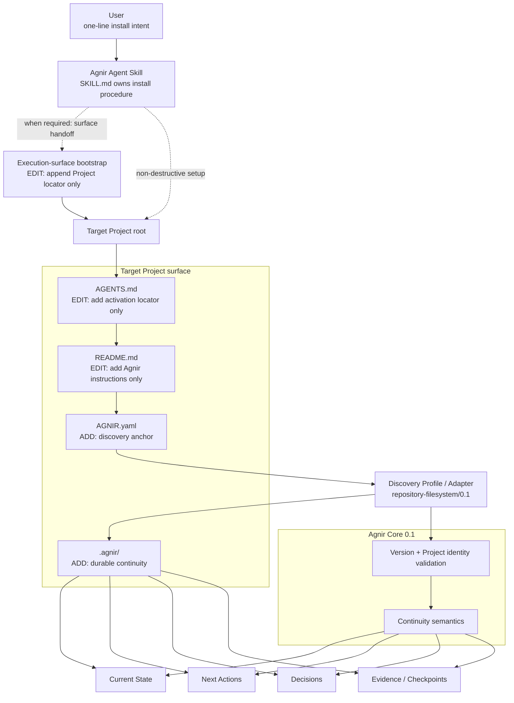
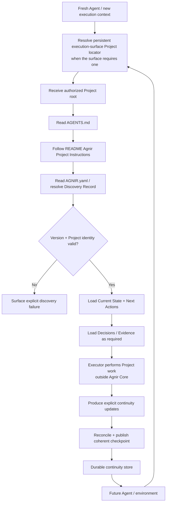

# Agnir

**English** | [简体中文](README.zh-CN.md)

Agnir is a **project-owned durable continuity protocol**.

It lets a Project resume safely when Agents, conversations, execution environments, or storage implementations change. The Project owns the durable continuity; execution surfaces do not.

**Name.** `Agnir` is taken from Icelandic `agnir`, the nominative plural of `ögn`, meaning a tiny bit or particle. The name matches Agnir's model: durable Project continuity is composed from small, discoverable pieces of Project truth — Current State, Next Actions, Decisions, and Evidence — that together let a fresh Executor understand and resume the Project.

## Start Here

This section is for users. Pick the action you want and give the Agent only the corresponding intent.

### Install Agnir in a new Project

```text
Install and initialize Agnir for this Project: https://github.com/iorLab/agnir
```

### Upgrade an existing Agnir Project

```text
Upgrade Agnir to the latest stable release: https://github.com/iorLab/agnir
```

### Continue normal work

**No recurring Agnir prompt is required.** Give the Agent access to the Project and ask for the actual task.

Some execution surfaces need a one-time persistent Project locator before a fresh context can reach the Project's own activation route. During install or upgrade, the Agnir Skill must either configure that surface when it can or give the user a copy-ready handoff; it must not claim full activation while required execution-surface configuration is pending. This is execution-surface integration, not Agnir Core or Project memory.

For install or upgrade operations, the Agent should use the root [`SKILL.md`](SKILL.md) as the canonical procedure. The user does not need to carry Agnir's internal checklist.

After repository initialization and any required one-time execution-surface configuration, an Agent-operable repository Project persists its own activation route:

```text
Project root
→ AGENTS.md
→ README.md / Agnir Project Instructions
→ AGNIR.yaml
→ durable memory
```

`latest stable` means an actually published stable tag/release, never a moving `main` branch. Compatible upgrades preserve Project identity and durable continuity; compatibility-line changes require migration rather than silent rewriting.

## Agnir Project Instructions

> **For Agents.** Users normally do not need to read this section.

1. **Discover.** Treat this repository root as the authorized Project Entry Point. Read top-level `AGNIR.yaml` and validate the declared Agnir Core/profile compatibility and Project identity.
2. **Load.** Load Current State and Next Actions from the declared durable memory. Load Decisions and Evidence when they materially constrain the current operation. Prefer durable Project truth over chat history or private Agent memory unless superseded by a newer Principal instruction or a directly observed current Project fact.
3. **Work.** Perform the actual Project task outside Agnir Core. For install, upgrade, or repair operations, root `SKILL.md` is the canonical Agent-facing procedure.
4. **Checkpoint.** At an intentional checkpoint, save-progress, finish, or repository commit boundary, reconcile only material continuity changes. Unchanged durable truth is a no-op. Material changes must form one coherent authoritative transition; reject stale-base publication with `AGNIR_CHECKPOINT_CONFLICT` rather than overwriting newer truth, then verify fresh discovery after publication.
5. **Commit / push.** In repository/VCS context, authorized `commit`, `提交`, `提交代码`, or equivalent intent means checkpoint before commit and preferably one revision for Project + Agnir changes. `commit and push`, `提交推送`, or equivalent adds push plus authoritative-ref verification. Merely observing an external commit triggers checkpoint evaluation, not an unconditional Agnir write.

Root `AGENTS.md` is intentionally only a locator to this section; it must not become a second copy of Project state or the Agnir procedure. The canonical activation route is:

`Project root -> AGENTS.md -> README.md / Agnir Project Instructions -> AGNIR.yaml -> declared durable memory`

If an activation locator, identity, required memory locator, or compatibility check fails, surface the failure or repair the earliest faulty layer when authorized. Do not invent Project state or silently fall back to chat history, sibling repositories, or retired layouts.

## What Agnir Adds to a Project

When the reference Agnir Skill initializes a repository/filesystem Project, it establishes or validates a small **Project-owned continuity surface**. **Agnir does not take over existing Project files.** For `AGENTS.md` and `README.md`, the Skill only adds the Agnir entry it needs while preserving unrelated existing content; the remaining Agnir continuity artifacts are normally added as new Project-owned files.

```text
Project/
├── AGENTS.md                 # [EDIT: add entry only] add Agnir activation locator; preserve existing instructions
├── AGNIR.yaml                # [ADD] discovery anchor: Project identity, compatibility, and memory locators
├── README.md                 # [EDIT: add entry only] add ## Agnir Project Instructions; preserve existing content
└── .agnir/                   # [ADD] Project-owned durable continuity
    ├── state.md              # [ADD] current durable Project truth
    ├── next-actions.md       # [ADD] outstanding ordered work for the next Executor
    ├── decisions.md          # [ADD] durable decisions that constrain future work
    └── evidence/             # [ADD] evidence/checkpoints needed for recovery, audit, or material claims
```

Execution-surface configuration is not a Project file and is not part of this Project-owned tree. If a surface needs one-time persistent settings — for example, ChatGPT Project Instructions — the Skill should append or ask the user to append only a locator to this Project, preserving unrelated surface instructions. The Project's own `AGENTS.md → README → AGNIR.yaml` route remains canonical.

The reference layout normally records at least one initialization Evidence object. `AGNIR.yaml` locators are authoritative, so `.agnir/` is the recommended colocated layout for this profile rather than a universal Agnir Core requirement.

Agnir adds continuity metadata and durable Project truth; it does **not** copy the Project, require raw chat transcripts, or make Git/GitHub part of Agnir Core.

## Architecture Diagram



`SKILL.md` is an Agent-facing packaging layer, and `AGENTS.md → README` is an Agent-operable repository activation convention. Execution-surface bootstrap is a separate adapter concern: when a surface does not automatically reach the Project, it stores only enough persistent locator information to enter this route. None of these are Agnir Core dependencies. An Executor or adapter that already knows the applicable profile may begin directly at the Project Entry Point / Discovery Record.

Agnir Core defines durable continuity semantics and discovery invariants; it does **not** require Git, GitHub, a repository, ChatGPT, an AI Agent, a Skill system, or any specific storage backend.

## Skill packaging boundary

Agnir deliberately separates the user intent from the Agent procedure:

- **User-facing requests** stay short: install, upgrade, or continue the real task.
- **Agent-facing procedure** lives in root `SKILL.md`, which owns install / initialize / upgrade / resume / checkpoint / commit / push / repair behavior.

The Skill is a distribution and operational entry surface. It does not change Agnir Core semantics. After initialization, the target Project is self-describing through its own `AGENTS.md` → README → `AGNIR.yaml` activation/discovery route; normal future work does not require reopening the Skill just to remind the Agent that Agnir exists.

When the execution surface itself needs persistent configuration to reach the Project, the Skill treats that as a one-time surface handoff. It preserves unrelated surface instructions, keeps the handoff locator-only, and reports surface activation separately from repository activation instead of claiming a fresh context is ready before the handoff is configured.

The concrete repository/filesystem Project surface is summarized above in **What Agnir Adds to a Project**. The normative initialization/activation contract is defined by [`profiles/REPOSITORY_FILESYSTEM.md`](profiles/REPOSITORY_FILESYSTEM.md); `SKILL.md` is the Agent-facing procedure that applies it.

## Continuity Flow

Once installation and any required one-time execution-surface configuration are complete, normal Project continuity does not depend on the original user install prompt or installation conversation:



Agnir does not perform the Project work shown in the middle of the flow. It makes continuity durable, discoverable, attributable to the correct Project, and safe to resume. Discovery failures such as not-found, ambiguity, unsupported version, Project mismatch, authorization failure, cycles, stale locators, and material inconsistency must be surfaced rather than silently repaired by guessing.

## Active line

`main` is the stable Agnir `0.1.0` release line. The compatibility identifiers remain Core `0.1` and `repository-filesystem/0.1`; repository SemVer is tracked separately in `VERSION`.

Predecessor PPMP / PPM / Sandminni material is archival under `history/` and immutable Git history; it is not part of the active compatibility contract.

## Release status

Agnir `v0.1.0` is formally published as the current stable repository release. The immutable `v0.1.0` tag points to the exact verified publication candidate `2a0cb7bf2068b11f361e315670b2f2dc497b2588`; later `main` checkpoints do not redefine that release target. `RELEASE.md` defines the version model, release surface, gates, and known limits.

Keep the three version layers distinct:

- Core compatibility: `0.1`;
- repository/filesystem profile: `repository-filesystem/0.1`;
- repository release: `0.1.0`.

## Repository structure

```text
agnir/
├── spec/                              # current protocol contracts
│   ├── AGNIR_CORE.md                  # Core 0.1, including transactional checkpoint semantics
│   └── AGNIR_DISCOVERY.md             # discovery / Locator Chain / failures
├── profiles/
│   └── REPOSITORY_FILESYSTEM.md       # repository-filesystem/0.1 activation/init + VCS event integration
├── schemas/
│   └── agnir-manifest.schema.json     # AGNIR.yaml schema
├── conformance/
│   ├── check_agnir_0_1.py             # self-host + release-readiness
│   ├── activation_reference.py        # AGENTS → README activation resolver
│   ├── checkpoint_reference.py        # atomic/no-op/conflict checkpoint reference model
│   ├── test_skill_package.py          # Skill / user-prompt boundary + commit intent tests
│   └── test_*.py                      # other executable conformance
├── .agnir/                            # this Project's canonical durable continuity
├── history/                           # historical lineage only
├── .github/workflows/                 # CI
├── SKILL.md                           # canonical Agent-facing Agnir Skill procedure
├── AGENTS.md                          # locator to README canonical Project instructions
├── AGNIR.yaml                         # repository/filesystem discovery anchor
├── RELEASE.md
├── README.md
├── README.zh-CN.md
└── VERSION                            # 0.1.0
```

For the exhaustive tracked-file map, see **[REPOSITORY_TREE.md](REPOSITORY_TREE.md)**.

## Core memory semantics

Agnir requires durable recovery of Current State, Next Actions, Decisions, and Evidence / Checkpoints. A fresh compatible Executor must recover the truth needed to continue the Project without predecessor-private conversational context.

## Relationship to Svif

Svif is a separate **Project orchestration product** at `iorLab/svif`. Its current continuity integration uses Agnir as the founding Continuity Provider; Agnir does not depend on Svif and remains independently usable.

## Documentation synchronization rule

`README.md` and `README.zh-CN.md` are parallel entry points. Changes to the layer model, Skill/install boundary, activation path, discovery path, durable-memory semantics, Project boundary, execution-surface handoff, or continuity flow must update the affected explanations/diagrams in both languages in the same change set.

Before the Architecture Diagram, README content is deliberately limited to a concise Project identity/name explanation, **Start Here** for users, the canonical **Agnir Project Instructions** for Agents, and **What Agnir Adds to a Project** as a concrete user-facing map of the installed Project surface. Installation and upgrade prompts stay one sentence each; packaging rationale, compatibility rationale, publication detail, and deeper implementation explanation belong after the architecture entry point or in dedicated documents.

`REPOSITORY_TREE.md` is the exhaustive structural map; it describes evidence-directory responsibility rather than duplicating every checkpoint evidence filename.

## Conformance

Run:

```bash
python conformance/check_agnir_0_1.py
python -m unittest discover -s conformance -p 'test_*.py' -v
```

The `0.1.0` suite covers Agent Skill packaging, durable prompt-free Project activation, repository/filesystem discovery and failures, checkpoint atomic/no-op/conflict semantics, SQLite non-repository continuity, external-memory authorization, multi-project isolation, Locator Chain failures, symlink boundaries, and real Git worktree cold start.

Real mount-boundary behavior remains explicitly unproven; an ordinary directory is not accepted as mount evidence.