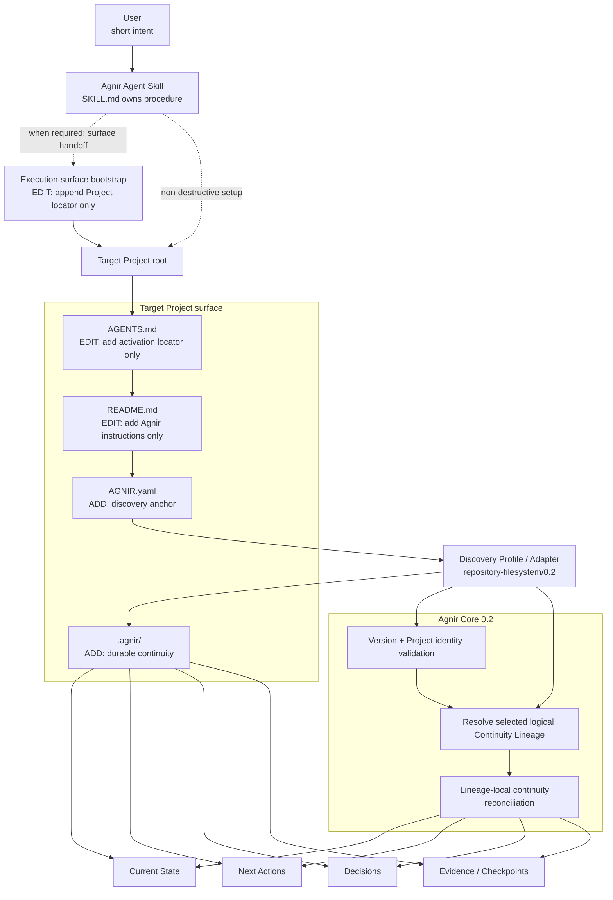
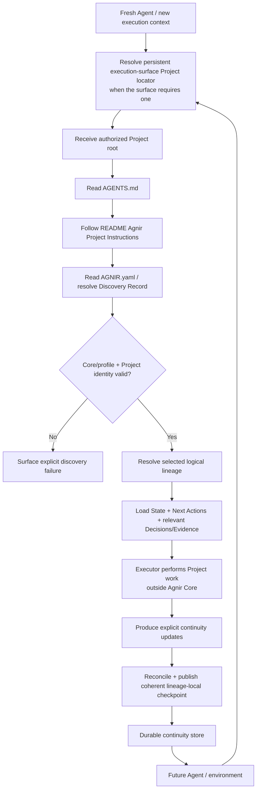

# Agnir

**English** | [简体中文](README.zh-CN.md)

Agnir is a **project-owned durable continuity protocol**.

It lets a Project resume safely when Agents, conversations, execution environments, storage implementations, or parallel work contexts change. The Project owns durable continuity; execution surfaces and backend selectors do not.

**Name.** `Agnir` is taken from Icelandic `agnir`, the nominative plural of `ögn`, meaning a tiny bit or particle. The name matches Agnir's model: durable Project continuity is composed from small, discoverable pieces of Project truth — Current State, Next Actions, Decisions, and Evidence — that together let a fresh Executor understand and resume the Project.

## Start Here

This section is for users. Pick the action you want and give the Agent only the corresponding intent.

### Install Agnir in a new Project

```text
Install and initialize Agnir for this Project: https://github.com/iorLab/agnir
```

### Upgrade an existing Agnir Project

```text
Upgrade Agnir to the latest stable release: https://github.com/iorLab/agnir
```

### Continue normal work

**No recurring Agnir prompt is required.** Give the Agent access to the Project and ask for the actual task.

Some execution surfaces need a **one-time persistent Project locator** before a fresh context can reach the Project's own activation route. During install or upgrade, the Agnir Skill must either configure that surface when it can or give the user a **copy-ready handoff**; it must report surface activation separately from repository activation and must not claim full activation while required execution-surface configuration is pending. This is execution-surface integration, not Agnir Core or Project memory.

For install, migration, upgrade, or repair operations, the Agent should use root [`SKILL.md`](SKILL.md) as the canonical procedure. The user does not need to carry Agnir's internal checklist.

After repository initialization and any required one-time execution-surface configuration, an Agent-operable repository Project persists its own activation route:

```text
Project root
→ AGENTS.md
→ README.md / Agnir Project Instructions
→ AGNIR.yaml
→ selected durable continuity
```

`latest stable` means an actually published stable tag/release, never a moving `main` branch or prerelease. During this RC cycle, published `v0.1.1` remains latest stable until final `v0.2.0` is intentionally published. Compatible operational upgrades preserve Project identity and durable continuity; a Core/profile compatibility-line change such as `0.1` → `0.2` requires explicit migration rather than silent rewriting.

## Agnir Project Instructions

> **For Agents.** Users normally do not need to read this section.

1. **Discover.** Treat this repository root as the authorized Project Entry Point. Read top-level `AGNIR.yaml`; validate the declared Agnir Core/profile compatibility, Project identity, and — for Core `0.2` — the selected logical Continuity Lineage. If a backend selector/binding is present, validate it separately from lineage identity.
2. **Load.** Load Current State and Next Actions from the declared selected continuity. Load Decisions and Evidence when they materially constrain the current operation. Prefer durable Project truth over chat history or private Agent memory unless superseded by a newer Principal instruction or a directly observed current Project fact.
3. **Work.** Perform the actual Project task outside Agnir Core. For install, migration, upgrade, or repair operations, root `SKILL.md` is the canonical Agent-facing procedure.
4. **Checkpoint.** At an intentional checkpoint, save-progress, finish, or repository **commit boundary**, reconcile only material continuity changes for the selected lineage. Unchanged durable truth is a no-op. Material changes must form one coherent authoritative transition; reject stale-base publication with `AGNIR_CHECKPOINT_CONFLICT` rather than overwriting newer truth, then verify fresh discovery after publication.
5. **Commit / push.** In repository/VCS context, authorized `commit`, `提交`, `提交代码`, or equivalent intent means checkpoint before commit and preferably one revision for Project + Agnir changes. `commit and push`, `提交推送`, or equivalent adds push plus verification of the actual destination ref. A claim of authoritative publication additionally requires the declared authoritative ref when one exists. Merely observing an external commit triggers checkpoint evaluation, not an unconditional Agnir write.
6. **Integrate lineages safely.** For Core `0.2` parallel continuity, source continuity is reconciliation input, not target truth. Stage integration without advancing the target when Agnir controls the path, reconcile target continuity against the actual integrated Project result, and publish the integrated Project + reconciled target checkpoint coherently.

Root `AGENTS.md` is intentionally only a locator to this section; it must not become a second copy of Project state or the Agnir procedure. The canonical activation route is:

`Project root -> AGENTS.md -> README.md / Agnir Project Instructions -> AGNIR.yaml -> declared durable memory`

If an activation locator, identity, lineage/binding, required memory locator, or compatibility check fails, surface the failure or repair the earliest faulty layer when authorized. Do not invent Project state or silently fall back to chat history, sibling repositories, sibling branches, or retired layouts.

## What Agnir Adds to a Project

When the reference Agnir Skill initializes a repository/filesystem Project, it establishes or validates a small **Project-owned continuity surface**. **Agnir does not take over existing Project files.** For `AGENTS.md` and `README.md`, the Skill only adds the Agnir entry it needs while preserving unrelated existing content; the remaining Agnir continuity artifacts are normally added as new Project-owned files.

```text
Project/
├── AGENTS.md                 # [EDIT: add entry only] add Agnir activation locator; preserve existing instructions
├── AGNIR.yaml                # [ADD] discovery anchor: Project identity, compatibility, selected lineage, memory locators
├── README.md                 # [EDIT: add entry only] add ## Agnir Project Instructions; preserve existing content
└── .agnir/                   # [ADD] Project-owned durable continuity
    ├── state.md              # [ADD] current durable truth for the selected lineage
    ├── next-actions.md       # [ADD] outstanding ordered work for the selected lineage
    ├── decisions.md          # [ADD] durable decisions that constrain future work
    └── evidence/             # [ADD] evidence/checkpoints needed for recovery, audit, reconciliation, or material claims
```

Execution-surface configuration is not a Project file and is not part of this Project-owned tree. If a surface needs one-time persistent settings — for example, ChatGPT Project Instructions — the Skill should **append Project locator only** (or ask the user to append it), preserving unrelated surface instructions. The **Execution-surface bootstrap** points to the Project; the Project's own `AGENTS.md → README → AGNIR.yaml` route remains canonical.

The reference layout normally records at least one initialization Evidence object. `AGNIR.yaml` locators are authoritative, so `.agnir/` is the recommended colocated layout for this profile rather than a universal Agnir Core requirement.

Agnir adds continuity metadata and durable Project truth; it does **not** copy the Project, require raw chat transcripts, or make Git/GitHub part of Agnir Core.

## Architecture Diagram



`SKILL.md` is an Agent-facing packaging layer, and `AGENTS.md → README` is an Agent-operable repository activation convention. Execution-surface bootstrap is a separate adapter concern: when a surface does not automatically reach the Project, it stores only enough persistent locator information to enter this route. None of these are Agnir Core dependencies.

Core `0.2` adds explicit **Continuity Lineages** without making Git or branch names Core concepts. A logical lineage is durable within Project scope. A VCS ref/worktree may select or bind that lineage; a commit SHA may be a checkpoint receipt. These are distinct semantics:

```text
Project identity
      │
      ├── logical Continuity Lineage A ── selected/bound by backend context A
      │        └── checkpoints / receipts
      │
      └── logical Continuity Lineage B ── selected/bound by backend context B
               └── checkpoints / receipts
```

For a VCS-backed Project, branch/ref/worktree is a selector/binding, **not automatically lineage identity**. Forking a new Agnir-controlled lineage must publish its new logical identity, selector binding, and coherent inherited/reconciled continuity together. Rename/rebind may preserve lineage identity. External ambiguous copies must fail/require repair instead of guessing.

### Integration publication

When Agnir controls source→target lineage integration, the safe sequence is:

```text
capture target + source receipts
→ stage integrated Project candidate without target advancement
→ reconcile target continuity
→ construct target checkpoint
→ publish integrated Project + reconciled target continuity together
→ fresh-resolve target and source
```

Source State/Next Actions/Decisions/Evidence are inputs to reconciliation; they are never automatic target truth.

## Skill packaging boundary

Agnir deliberately separates user intent from Agent procedure:

- **User-facing requests** stay short: install, upgrade, or continue the real task.
- **Agent-facing procedure** lives in root `SKILL.md`, which owns install / initialize / migration / upgrade / resume / checkpoint / commit / push / repair behavior.

The Skill is a distribution and operational entry surface. It does not change Agnir Core semantics. After initialization, the target Project is self-describing through its own `AGENTS.md` → README → `AGNIR.yaml` activation/discovery route; normal future work does not require reopening the Skill just to remind the Agent that Agnir exists.

When the execution surface itself needs persistent configuration to reach the Project, the Skill treats that as a one-time surface handoff. It preserves unrelated surface instructions, keeps the handoff locator-only, and reports surface activation separately from repository activation instead of claiming a fresh context is ready before the handoff is configured.

For a published stable install/upgrade request, the Skill resolves an actually published stable release. An explicitly authorized RC/prerelease target may use Core/profile `0.2` according to that candidate's migration/install procedure; it must not cause `latest stable` to resolve to the RC.

## Continuity Flow

Once installation and any required one-time execution-surface configuration are complete, normal Project continuity does not depend on the original user install prompt or installation conversation:



Agnir does not perform the Project work shown in the middle of the flow. It makes continuity durable, discoverable, attributable to the correct Project and selected lineage, and safe to resume. Discovery failures such as not-found, ambiguity, unsupported version, Project mismatch, authorization failure, lineage/binding failure, cycles, stale locators, and material inconsistency must be surfaced rather than silently repaired by guessing.

## Compatibility and migration

Core/profile compatibility lines are explicit contracts:

- Core `0.1` + `repository-filesystem/0.1` remains the compatibility line of published stable `v0.1.1`.
- Core `0.2` + `repository-filesystem/0.2` is the compatibility candidate exercised by `v0.2.0-rc.1`.

A `0.1` Project's single implicit continuity line may migrate to exactly one initial/default `0.2` logical lineage. Migration preserves `project.identity`, durable continuity, and applicable memory locators; it does not silently reinterpret an operational upgrade. See [`spec/CORE_0_1_TO_0_2_MIGRATION.md`](spec/CORE_0_1_TO_0_2_MIGRATION.md).

## Active line and release status

The repository is preparing `v0.2.0-rc.1`. On the release branch, Agnir self-hosts Core `0.2` / `repository-filesystem/0.2`; the candidate's logical lineage is distinct from its VCS selector binding.

The latest published stable release remains immutable `v0.1.1` at `e9712357ab590e5c1e5357b3cf3219d07d789aff` until final `v0.2.0` is actually published. The RC is a prerelease and must never be silently substituted for `latest stable`.

Keep the version layers distinct:

- repository candidate: `0.2.0-rc.1`;
- Core compatibility candidate: `0.2`;
- repository/filesystem profile candidate: `repository-filesystem/0.2`;
- latest published stable repository release: `0.1.1`.

[`RELEASE.md`](RELEASE.md) records the RC publication gate and the immutable stable baseline.

## Repository structure

```text
agnir/
├── spec/                              # protocol contracts and migration
│   ├── AGNIR_CORE.md                  # Core 0.1 compatibility contract
│   ├── AGNIR_CORE_0_2.md              # Core 0.2 RC normative contract
│   ├── AGNIR_DISCOVERY.md             # discovery / Locator Chain / failures
│   └── CORE_0_1_TO_0_2_MIGRATION.md   # explicit compatibility migration
├── profiles/
│   ├── REPOSITORY_FILESYSTEM.md       # repository-filesystem/0.1
│   ├── REPOSITORY_FILESYSTEM_0_2.md   # repository-filesystem/0.2 RC profile
│   └── VCS_BRANCH_CONTINUITY.md       # VCS mapping/extension pressure
├── schemas/                           # 0.1 + 0.2 manifest schemas
├── conformance/
│   ├── check_agnir_0_1.py             # stable 0.1 self-host/regression helpers
│   ├── check_agnir_0_2_rc.py          # RC Core/profile 0.2 self-host gate
│   ├── activation_reference.py        # AGENTS → README activation resolver
│   ├── checkpoint_reference.py        # coherent/no-op/conflict checkpoint model
│   ├── test_skill_package.py          # Skill / user-UX / handoff pressure
│   └── test_*.py                      # backend, lineage, migration, integration pressure
├── .agnir/                            # this Project's canonical durable continuity
├── history/                           # historical predecessor material
├── .github/                           # CI workflows
├── SKILL.md                           # canonical Agent-facing procedure
├── AGENTS.md                          # locator to README Project instructions
├── AGNIR.yaml                         # selected Project/lineage discovery anchor
├── README.md
├── README.zh-CN.md
├── REPOSITORY_TREE.md                 # exhaustive tracked-file responsibility map
├── RELEASE.md                         # release/RC publication contract
└── VERSION                            # repository SemVer
```

For the exhaustive tracked-file map, see **[REPOSITORY_TREE.md](REPOSITORY_TREE.md)**.

## Core memory semantics

Agnir requires durable recovery of Current State, Next Actions, Decisions, and Evidence / Checkpoints for the selected continuity. A fresh compatible Executor must recover the truth needed to continue the Project without predecessor-private conversational context.

## Relationship to Svif

Svif is a separate **Project orchestration product** at `iorLab/svif`. It uses Agnir as a founding Continuity Provider but Agnir remains independently usable. Svif also supplied the first real Core `0.2` consumer validation: explicit migration, two independent lineages, staged target reconciliation/publication, and independent source resume.

## Documentation synchronization rule

`README.md` and `README.zh-CN.md` are parallel entry points. Changes to the layer model, Skill/install boundary, activation path, discovery path, durable-memory semantics, Project boundary, execution-surface handoff, lineage selection/integration, or continuity flow must update both languages in the same change set.

Before the Architecture Diagram, README content is deliberately limited to a concise Project identity/name explanation, **Start Here** for users, the canonical **Agnir Project Instructions** for Agents, and **What Agnir Adds to a Project** as a concrete user-facing map of the installed Project surface. Installation and upgrade prompts stay one sentence each; deeper implementation/release detail belongs after the architecture entry point or in dedicated documents.

`REPOSITORY_TREE.md` is the exhaustive structural map; it describes evidence-directory responsibility rather than duplicating every checkpoint Evidence filename.

## Conformance

The release branch runs exact-head CI for RC self-hosting, stable `0.1` regression, Core `0.2` VCS/non-VCS/profile/binding/migration pressure, and the full suite. See [`.github/workflows/conformance.yml`](.github/workflows/conformance.yml).
