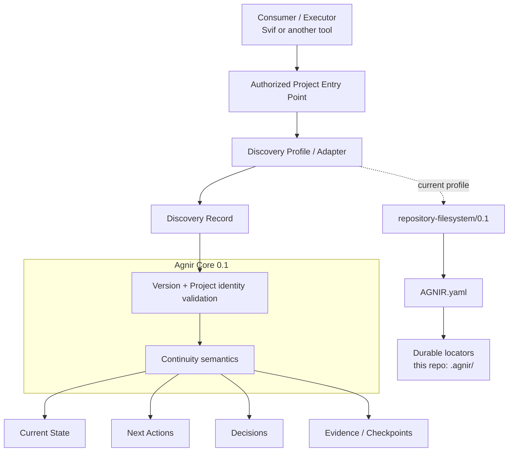
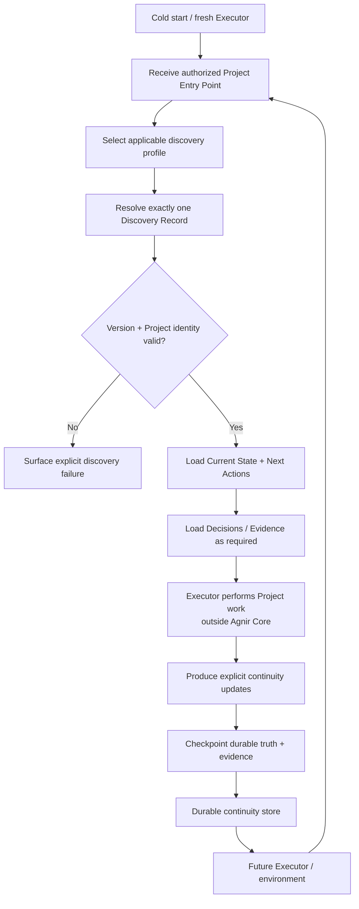

# Agnir

**English** | [简体中文](README.zh-CN.md)

Agnir is a **project-owned durable continuity protocol**.

It exists so a Project can be safely resumed when Executors, execution environments, storage implementations, or conversational contexts change. The Project owns the durable continuity; execution surfaces do not.

## 30-second Quick Start

If your Agent can read and write the Project directory, the `repository-filesystem/0.1` profile does **not** require a daemon, account, GitHub integration, ChatGPT, or another special execution surface.

### Use an existing Agnir Project

Give the Agent the Project root and paste this prompt:

```text
Use Agnir for this Project. Treat the Project root as the authorized Project Entry Point. Before doing work, read the top-level AGNIR.yaml and follow its declared memory locators. Load Current State and Next Actions, and load Decisions and Evidence when relevant. Treat durable Agnir memory as canonical over chat history or private Agent memory. When I say checkpoint, save progress, or finish, reconcile material updates into the declared Agnir memory and verify the Project can cold-start again from the same entry point.
```

For an Agent that already has filesystem access, that is enough to start using an Agnir-enabled Project.

### Initialize Agnir in a new Project

You can also ask an Agent to create the minimum repository/filesystem setup for you:

```text
Initialize Agnir Core 0.1 for this Project using repository-filesystem/0.1. Create a top-level AGNIR.yaml with a durable project.identity and locators for .agnir/state.md, .agnir/next-actions.md, .agnir/decisions.md, and .agnir/evidence/. Create those files/directories with minimal initial content, including one tracked initialization evidence file. Then cold-start from the Project root, read AGNIR.yaml, verify every locator resolves, and use Agnir for future checkpoint/resume.
```

The minimum manifest can look like this:

```yaml
agnir:
  version: "0.1"
  discovery_profile: "repository-filesystem/0.1"

project:
  identity: "urn:example:project:my-project"

memory:
  state: ".agnir/state.md"
  next_actions: ".agnir/next-actions.md"
  decisions: ".agnir/decisions.md"
  evidence: ".agnir/evidence/"

policy:
  checkpoint: event-driven
```

With a simple colocated layout:

```text
.agnir/
├── state.md              # current truth needed to continue safely
├── next-actions.md       # outstanding work and priorities
├── decisions.md          # durable accepted decisions and rationale
└── evidence/
    └── initialization.md # first tracked checkpoint/evidence file
```

The files can start small. The important rule is that facts required for a future Executor to continue safely must live in the declared durable memory, not only in a chat or one Agent's private context.

## Architecture Diagram



Agnir Core defines durable continuity semantics and discovery invariants; it does **not** require Git, GitHub, a repository, ChatGPT, or any specific storage backend. Profiles/adapters realize those semantics for a concrete Project Entry Point and storage environment.

For this repository, the active realization is `repository-filesystem/0.1`: cold start begins at the Project root, resolves top-level `AGNIR.yaml`, validates the Project identity and Agnir line, then follows the declared memory locators. `AGNIR.yaml` and `.agnir/` are profile/repository choices, not universal Core requirements.

## Continuity Flow



Agnir does not perform the Project work shown in the middle of the flow. It makes the before/after continuity durable, discoverable, attributable to the correct Project, and safe to resume. Discovery failures such as not-found, ambiguity, unsupported version, Project mismatch, authorization failure, cycles, stale locators, and material inconsistency must be surfaced rather than silently repaired by guessing.

## Active line

`main` is the stable Agnir `0.1.0` release line. The protocol compatibility identifiers remain Core `0.1` and `repository-filesystem/0.1`; repository SemVer is tracked separately in `VERSION`.

Predecessor PPMP v2.0.0 / Persistent Project Memory / Sandminni history is referenced by immutable commit SHA and the documents under `history/`; no live legacy branch or predecessor bootstrap path is part of the active protocol contract.

## Release status

The current repository is **ready for publication as Agnir `0.1.0`**. `RELEASE.md` defines the frozen version model, release scope, publication gate, and known limitation. Creating the `v0.1.0` Git tag or GitHub Release remains a separate publication action.

Version layers are intentionally distinct:

- Core compatibility: `0.1`;
- repository/filesystem profile compatibility: `repository-filesystem/0.1`;
- repository release: `0.1.0`.

## Repository Structure

This tree is the practical map of the repository. It shows the directories and key files that explain where current protocol definition, discovery profiles, executable conformance, Project continuity, and predecessor history live.

```text
agnir/
├── spec/                              # active protocol-level definitions; storage and execution surface remain abstract
│   ├── AGNIR_CORE.md                  # stable Core 0.1 continuity semantics and invariants
│   └── AGNIR_DISCOVERY.md             # cold-start discovery, Locator Chain, identity, and failure semantics
│
├── profiles/                          # concrete discovery/storage realizations layered outside Core
│   └── REPOSITORY_FILESYSTEM.md       # current repository-filesystem/0.1 profile
├── schemas/                           # machine-readable serializations for concrete profile artifacts
│   └── agnir-manifest.schema.json     # JSON Schema for this profile's AGNIR.yaml manifest
│
├── conformance/                       # executable pressure proving the current Core/profile semantics
│   ├── check_agnir_0_1.py             # self-hosting cold-start and stable release-readiness structure check
│   ├── *_reference.py                 # conformance-only executable reference models; not production implementations
│   └── test_*.py                      # failure, backend, authorization, isolation, and boundary fixtures
│
├── .agnir/                            # this Agnir Project's own canonical durable continuity
│   ├── state.md                       # current Project state
│   ├── next-actions.md                # next durable work to resume
│   ├── decisions.md                   # durable protocol/project decisions and rationale
│   └── evidence/                      # checkpoint and conformance evidence records
│
├── history/                           # predecessor lineage and optional historical guidance; not active Core
│   ├── PREDECESSOR.md                 # predecessor boundary referenced by immutable commit SHA
│   ├── MIGRATION_PPMP_V2.md           # optional historical migration guide; not Core/conformance/release gate
│   └── BRANCH_ARCHIVE.md              # retired branch names and final tip SHAs; main-only governance record
├── .github/workflows/                 # CI that runs self-hosting and executable conformance
├── AGNIR.yaml                         # this repository's repository-filesystem discovery anchor; not a universal Core requirement
├── RELEASE.md                         # stable release version model, scope, known limitation, and publication gate
├── README.md                          # English project entry point
├── README.zh-CN.md                    # Simplified Chinese project entry point
└── VERSION                            # repository SemVer; currently 0.1.0
```

For the fully expanded file-by-file map of the current `main`, including responsibility annotations for every tracked file, see **[REPOSITORY_TREE.md](REPOSITORY_TREE.md)**.

Predecessor implementation/backend/adapter/site/template material is deliberately absent from active `main`; historical material is recoverable through `history/` and Git history. `history/` is archival/reference material and does not define current Agnir Core behavior.

## Core memory semantics

Agnir requires durable recovery of Current State, Next Actions, Decisions, and Evidence / Checkpoints.

A fresh Executor given only an authorized Project Entry Point must be able to resolve the Project's Discovery Record and required durable state without replaying predecessor-private context.

## Svif relationship

Svif is a separate **Project orchestration product** at `iorLab/svif`. Svif currently uses Agnir as its founding Continuity Provider through an Agnir adapter, but Agnir remains independently useful without Svif. Svif-specific execution, delivery, provider, authority, or distribution semantics do not belong in Agnir Core.

## Documentation synchronization

`README.md` and `README.zh-CN.md` are maintained as parallel entry points. Any change to Agnir's layer model, discovery path, durable-memory semantics, Project boundary, or continuity flow **must update the affected README diagrams in both language versions in the same change set**. The diagrams represent the current architecture and flow.

The README must keep the operational Quick Start before architecture material so a new user can start with an Agent without first learning the protocol internals. The plain-text **Repository Structure** tree remains a compact navigation view. The exhaustive companion **`REPOSITORY_TREE.md`** is the file-level map of the active repository and must be updated whenever tracked files are added, removed, moved, or materially change responsibility. If the change affects the compact tree, both README language versions must update it in the same change set as well.

## Conformance

Run the self-hosting structural check and the full executable pressure suite with:

```bash
python conformance/check_agnir_0_1.py
python -m unittest discover -s conformance -p 'test_*.py' -v
```

The stable `0.1.0` suite covers repository/filesystem cold start and explicit discovery failures, a durable non-repository SQLite realization, external-memory authorization without plaintext credentials, multi-project isolation with locator-only registry metadata, generic Locator Chain cycle/stale/inconsistency semantics, symlink boundary behavior, and real Git worktree cold start.

A real mount-boundary case remains intentionally unproven until a mount-capable test environment is available; Agnir does not treat an ordinary directory as fake mount evidence. This limitation is documented in `RELEASE.md` and is not represented as proven coverage.
