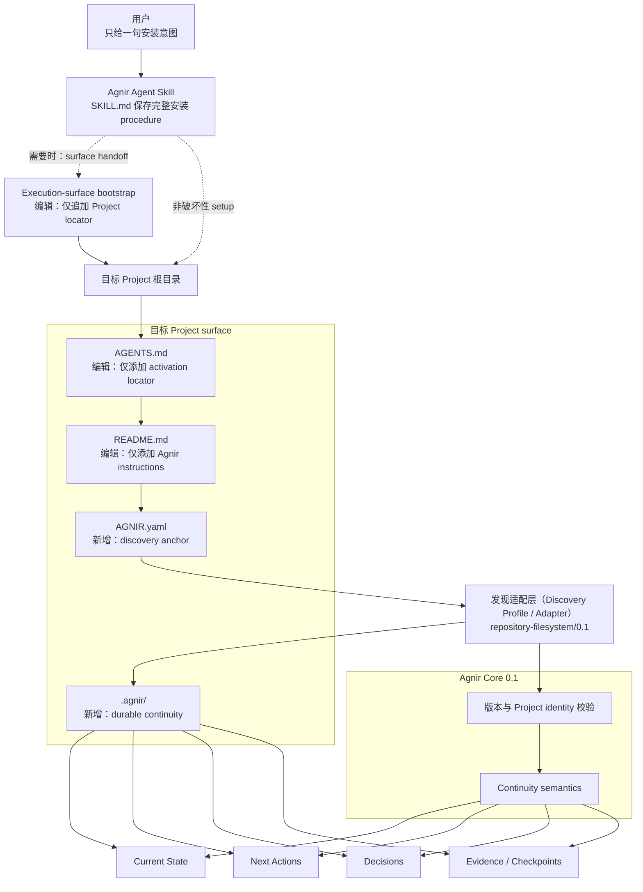
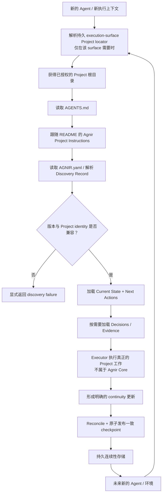

# Agnir

[English](README.md) | **简体中文**

Agnir 是一个 **由 Project 自己拥有的持久连续性协议（durable continuity protocol）**。

它让 Project 在 Agent、对话、执行环境或存储实现发生变化后仍然可以安全恢复和继续。Durable continuity 属于 Project，而不属于某个 execution surface。

**名字。** `Agnir` 取自冰岛语 `agnir`，是 `ögn` 的主格复数，意为“一小点”或“微粒（particle）”。这个名字对应 Agnir 的模型：Project 的持久连续性由一颗颗可发现的 Project truth 组成——Current State、Next Actions、Decisions 和 Evidence；这些“微粒”组合起来，使新的 Executor 即使没有前任的私有上下文，也能重新理解并继续 Project。

## 从这里开始

本节只面向用户。找到你现在要做的事，把对应的一句话交给 Agent 即可。

### 在新 Project 安装 Agnir

```text
为这个 Project 安装并初始化 Agnir：https://github.com/iorLab/agnir
```

### 升级已经使用 Agnir 的 Project

```text
把这个 Project 的 Agnir 升级到最新稳定版：https://github.com/iorLab/agnir
```

### 继续正常工作

**不需要再给 Agent 任何 Agnir bootstrap 提示词。** 直接让 Agent 访问 Project，并提出真正要做的任务。

有些 execution surface 需要一次性的持久 Project locator，新的执行上下文才能进入 Project 自己的 activation route。安装或升级时，Agnir Skill 必须在能够直接配置时完成配置，否则就自动给用户一段可直接复制的 handoff；只要必需的 execution-surface configuration 仍未完成，就不得宣称完整 activation 已通过。这属于 execution-surface integration，不属于 Agnir Core，也不是 Project memory。

安装或升级时，Agent 应把根目录 [`SKILL.md`](SKILL.md) 当作 canonical procedure；用户不需要携带 Agnir 的内部 checklist。

Repository 初始化完成，并完成任何必需的一次性 execution-surface configuration 后，Agent-operable repository Project 会自己持久保存激活路径：

```text
Project 根目录
→ AGENTS.md
→ README.md / Agnir Project Instructions
→ AGNIR.yaml
→ durable memory
```

`latest stable` 只指已经正式发布的稳定 tag / release，不能把会移动的 `main` 分支当成 stable。兼容升级必须保留 Project identity 与 durable continuity；compatibility line 发生变化时应进入 migration，而不是静默改写。

## Agnir Project Instructions

> **本节供 Agent 使用。** 普通用户通常不需要阅读。

1. **Discover。** 把本仓库根目录视为已授权的 Project Entry Point。读取顶层 `AGNIR.yaml`，校验声明的 Agnir Core/profile compatibility 与 Project identity。
2. **Load。** 从声明的 durable memory 加载 Current State 与 Next Actions；当 Decisions 与 Evidence 会实质约束本次操作时再加载。除非有更新的 Principal 指令或直接观察到的当前 Project 事实覆盖，否则 durable Project truth 优先于聊天记录或 Agent 私有记忆。
3. **Work。** 真正的 Project 工作发生在 Agnir Core 之外。安装、升级或 repair 时，根目录 `SKILL.md` 是 canonical Agent-facing procedure。
4. **Checkpoint。** 在明确的 checkpoint、保存进度、结束工作或 repository commit boundary 上，只 reconcile 有实质变化的 continuity。Durable truth 未变化时做 no-op；发生变化时必须形成一致的 authoritative transition。若 authoritative base 已过期，返回 `AGNIR_CHECKPOINT_CONFLICT`，不得覆盖更新事实；发布后重新验证 fresh discovery。
5. **Commit / push。** 在 repository / VCS 上下文中，已授权的 `commit`、`提交`、`提交代码` 或同义请求表示先 checkpoint 再 commit，并优先把 Project + Agnir 变化放进同一个 revision。`commit and push`、`提交推送` 或同义请求再加 push 与实际 destination ref verification；只有当操作声称发布了 authoritative truth 时，才额外要求命中已声明的 authoritative ref。只是观察到外部 commit，只触发 checkpoint evaluation，不代表无条件写入 Agnir。

根目录 `AGENTS.md` 只负责把 Agent 引导到本节，不得成为第二份 Project state 或 Agnir procedure。Canonical activation route 为：

`Project root -> AGENTS.md -> README.md / Agnir Project Instructions -> AGNIR.yaml -> declared durable memory`

如果 activation locator、Project identity、必需 memory locator 或 compatibility 校验失败，应显式暴露 failure，或在获得授权时修复最早出错的层；不得凭空补 Project state，也不得静默退回聊天历史、兄弟仓库或 retired layout。

## Agnir 会给 Project 增加什么

当 reference Agnir Skill 初始化一个 repository/filesystem Project 时，它会建立或校验一小组 **由 Project 自己拥有的 continuity 文件**。**Agnir 不会接管已有 Project 文件。** 对 `AGENTS.md` 和 `README.md`，Skill 只添加 Agnir 所需的入口，并保留原有无关内容；其余 Agnir continuity artifacts 通常作为新的 Project-owned 文件加入。

```text
Project/
├── AGENTS.md                 # [编辑：仅添加入口] 加入 Agnir activation locator；保留原有 instructions
├── AGNIR.yaml                # [新增] discovery anchor：声明 Project identity、兼容版本和 memory locators
├── README.md                 # [编辑：仅添加入口] 加入 ## Agnir Project Instructions；保留原有内容
└── .agnir/                   # [新增] Project 自己拥有的 durable continuity
    ├── state.md              # [新增] 当前仍然成立的 durable Project truth
    ├── next-actions.md       # [新增] 下一位 Executor 应继续推进的有序工作
    ├── decisions.md          # [新增] 会约束未来工作的持久决策
    └── evidence/             # [新增] 恢复、审计或重要事实声明所需的 Evidence / Checkpoints
```

Execution-surface configuration 不是 Project 文件，也不属于上面的 Project-owned tree。如果某个 surface 需要一次性持久设置——例如 ChatGPT Project Instructions——Skill 应只追加或要求用户追加一个指向本 Project 的 locator，并保留 surface 原有的无关 instructions。Project 自己的 `AGENTS.md → README → AGNIR.yaml` 路线仍然是 canonical。

Reference layout 通常还会在 `evidence/` 中保存至少一份初始化 Evidence。真正权威的是 `AGNIR.yaml` 中的 locators，因此 `.agnir/` 是当前 profile 推荐的 colocated layout，而不是 Agnir Core 的普遍强制目录。

Agnir 增加的是 continuity metadata 与 durable Project truth；它**不会**复制整个 Project，不要求保存原始聊天记录，也不会把 Git / GitHub 变成 Agnir Core 的依赖。

## 架构图（Architecture Diagram）



`SKILL.md` 是 Agent-facing packaging layer；`AGENTS.md → README` 是面向 Agent 的 repository activation convention。Execution-surface bootstrap 是单独的 adapter concern：当 surface 不能自动进入 Project 时，只持久保存足够的 locator 信息来进入这条路线。它们都不是 Agnir Core 的依赖。已经知道适用 profile 的 Executor / adapter 可以直接从 Project Entry Point / Discovery Record 开始。

Agnir Core **不要求** Git、GitHub、repository、ChatGPT、AI Agent、Skill system 或某种具体 storage backend。

## Skill 与用户提示词的边界

Agnir 明确把用户意图和 Agent procedure 分开：

- **给用户的请求**保持简短：安装、升级，或者直接提出真正的 Project 任务。
- **给 Agent 的 procedure**位于根目录 `SKILL.md`，完整负责 install / initialize / upgrade / resume / checkpoint / commit / push / repair。

Skill 是发行和操作入口，不改变 Agnir Core 语义。初始化完成后，目标 Project 已经通过自己的 `AGENTS.md → README → AGNIR.yaml` 路线做到 self-describing；以后正常工作不需要再打开 Skill 来提醒 Agent “这个 Project 使用 Agnir”。

如果 execution surface 自身需要持久配置才能进入 Project，Skill 会把它作为一次性的 surface handoff 处理：保留 surface 原有的无关 instructions，只写入 locator，并把 surface activation 与 repository activation 分开报告，不能在 handoff 尚未配置时宣称 fresh context 已经可用。

具体的 repository/filesystem Project surface 已经在前面的 **Agnir 会给 Project 增加什么** 中说明。规范性的初始化 / 激活要求由 [`profiles/REPOSITORY_FILESYSTEM.md`](profiles/REPOSITORY_FILESYSTEM.md) 定义；根目录 `SKILL.md` 是把这些要求交给 Agent 执行的 procedure。

## 连续性流程（Continuity Flow）

安装完成，并完成任何必需的一次性 execution-surface configuration 后，正常 Project continuity 不再依赖最初那句用户安装提示词，也不依赖初始化对话：



Agnir 不执行流程中间的 Project 工作。它负责让 continuity 持久、可发现、绑定到正确 Project，并让未来 Executor 可以安全恢复。Not-found、ambiguity、unsupported version、Project mismatch、authorization failure、cycle、stale locator、material inconsistency 等 failure 都必须显式暴露，不能靠猜测静默修复。

## 实验性多分支连续性

对于 repository / VCS implementation，Agnir 现在可以在不把 Git branch 放进 Core 的前提下验证 **branch-local continuity**。`profiles/VCS_BRANCH_CONTINUITY.md` 定义了实验性的 `agnir/vcs-branch-continuity/0.1` extension。

模型是：

```text
同一个 Project identity
        │
   ┌────┴────┐
   ▼         ▼
 main     feature/a
   │         │
Agnir M   Agnir F
   └────┬────┘
        │ merge / rebase / cherry-pick
        ▼
 target continuity reconciliation
        ▼
 新的 target checkpoint
```

分支发生 divergence 之后，每个已选中的 branch / worktree 都解析并 checkpoint 自己的 continuity。`authoritative_ref` 是 publication authority boundary，而不是唯一可以使用 Agnir 的分支。Merge、rebase、cherry-pick **不会**自动把 source Current State / Next Actions 晋升为 target truth；source continuity 只是 reconciliation input，target branch 必须 checkpoint 自己在集成后的真实状态。Rebase / history rewrite 可以改变 commit receipt，但不改变 Project identity。

这一能力目前刻意保持在 extension 层，不是 Core `0.2` 变更。通用、storage-neutral 的 `lineage.id` 继续延后，直到非 VCS 场景也能证明这个概念确实属于 Core。

## 当前版本线

`main` 是 Agnir `0.1.1` 的当前维护线。当前正式发布的稳定版本是 immutable `v0.1.1`。兼容标识仍然是 Core `0.1` 和 `repository-filesystem/0.1`；仓库 SemVer 独立记录在 `VERSION`。

PPMP / PPM / Sandminni 等前身材料只属于 `history/` 与 immutable Git history，不属于当前兼容契约。

## 发布状态

Agnir `v0.1.1` 已正式发布，是当前稳定的 repository release。Immutable `v0.1.1` tag 直接指向经过完整验证的精确 candidate `e9712357ab590e5c1e5357b3cf3219d07d789aff`；GitHub Actions `Agnir conformance` run `33499092957` 在该 revision 上通过，GitHub Release `Agnir v0.1.1` 的 release id 为 `380414987`。真实的 `mattamior/skills-hub` ChatGPT Project regression 已在发布前通过。`RELEASE.md` 记录发布契约与验证结果。

版本层必须区分：

- Core compatibility：`0.1`；
- repository/filesystem profile：`repository-filesystem/0.1`；
- 已发布 repository release：`0.1.1`。

## 仓库结构

```text
agnir/
├── spec/                              # 当前协议层定义
│   ├── AGNIR_CORE.md                  # Core 0.1，含 transactional checkpoint 语义
│   └── AGNIR_DISCOVERY.md             # discovery / Locator Chain / failures
├── profiles/
│   ├── REPOSITORY_FILESYSTEM.md       # repository-filesystem/0.1 activation/init + VCS event integration
│   └── VCS_BRANCH_CONTINUITY.md       # 实验性 parallel branch continuity + integration reconciliation
├── schemas/
│   └── agnir-manifest.schema.json     # AGNIR.yaml schema
├── conformance/
│   ├── check_agnir_0_1.py             # self-host + release-readiness
│   ├── activation_reference.py        # AGENTS → README activation resolver
│   ├── checkpoint_reference.py        # atomic/no-op/conflict checkpoint reference model
│   ├── vcs_branch_continuity_reference.py # branch/integration reference model
│   ├── test_skill_package.py          # Skill / 用户提示词边界 + commit intent 测试
│   └── test_*.py                      # 其他 executable conformance
├── brand/                            # 已批准品牌主稿、导出、QA、参考与交付说明
├── .agnir/                            # 本 Project 的 canonical durable continuity
├── history/                           # 仅历史 lineage
├── .github/workflows/                 # CI
├── SKILL.md                           # canonical Agent-facing Agnir Skill procedure
├── AGENTS.md                          # 指向 README canonical Project instructions
├── AGNIR.yaml                         # repository/filesystem discovery anchor
├── RELEASE.md
├── README.md
├── README.zh-CN.md
└── VERSION                            # 0.1.1
```

需要查看完整 tracked file 级目录树，请看 **[REPOSITORY_TREE.md](REPOSITORY_TREE.md)**。

## Core memory semantics

Agnir 要求能够持久恢复 Current State、Next Actions、Decisions 和 Evidence / Checkpoints。Fresh compatible Executor 必须能够恢复继续 Project 所需的 truth，而不依赖上一段私有对话上下文。

## 与 Svif 的关系

Svif 是独立的 **Project orchestration product**，位于 `iorLab/svif`。当前 Svif 通过 Agnir adapter 使用 Agnir 作为首个 Continuity Provider；Agnir 不依赖 Svif，也可以独立使用。

## 文档同步规则

`README.md` 与 `README.zh-CN.md` 是并行入口。Layer model、Skill / install 边界、activation path、discovery path、durable-memory semantics、Project boundary、execution-surface handoff 或 continuity flow 变化时，必须在同一个 change set 同步更新两种语言中受影响的说明 / 图。

在架构图之前，README 只保留简短的 Project 身份 / 名称解释、面向用户的 **从这里开始**、面向 Agent 的 canonical **Agnir Project Instructions**，以及面向用户解释安装结果的 **Agnir 会给 Project 增加什么**。安装与升级提示词都保持一句话；packaging rationale、compatibility rationale、publication detail 与更深入的实现说明应放到架构入口之后或专门文档中。

`REPOSITORY_TREE.md` 是完整结构地图；它说明 evidence 目录职责，不再重复登记每一个 checkpoint evidence 文件名。

## Conformance

运行：

```bash
python conformance/check_agnir_0_1.py
python -m unittest discover -s conformance -p 'test_*.py' -v
```

Stable `0.1.1` suite 覆盖 Agent Skill packaging、免重复提示的 Project activation、execution-surface handoff regression、repository/filesystem discovery 与 failures、checkpoint atomic/no-op/conflict 语义、SQLite 非 repository continuity、external-memory authorization、multi-project isolation、Locator Chain failures、symlink boundaries 和真实 Git worktree cold start。当前 development suite 另外验证实验性的 branch-local continuity、merge/rebase/cherry-pick reconciliation、history rewrite 下的 identity preservation，以及 destination-ref 与 authoritative-ref publication verification 的区分。

真实 mount-boundary 仍明确未验证；普通目录不能冒充 mount evidence。