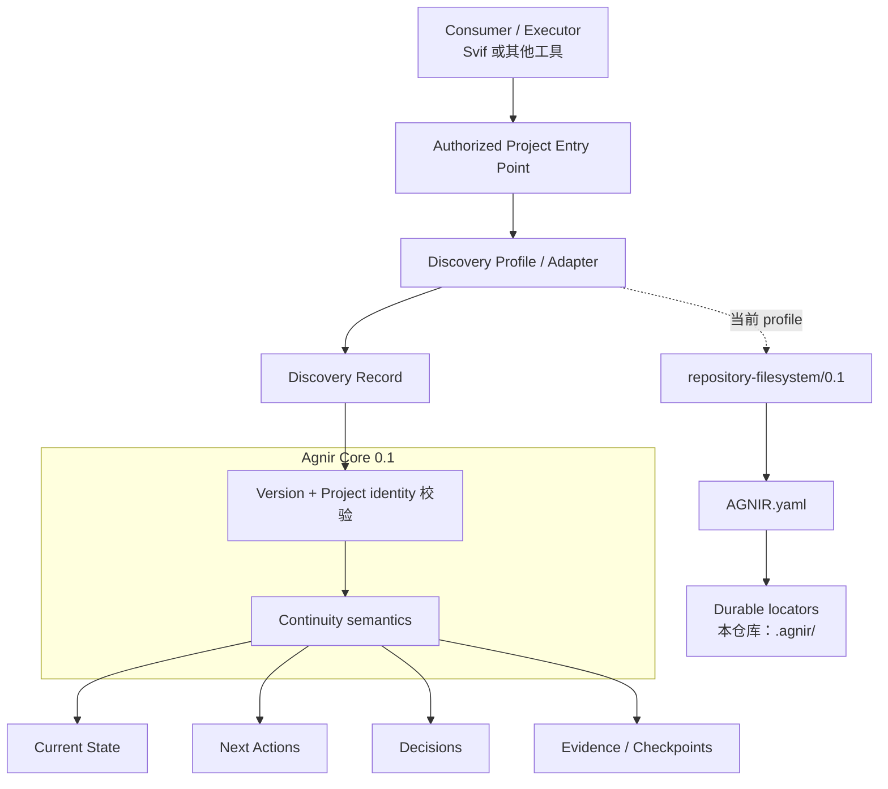
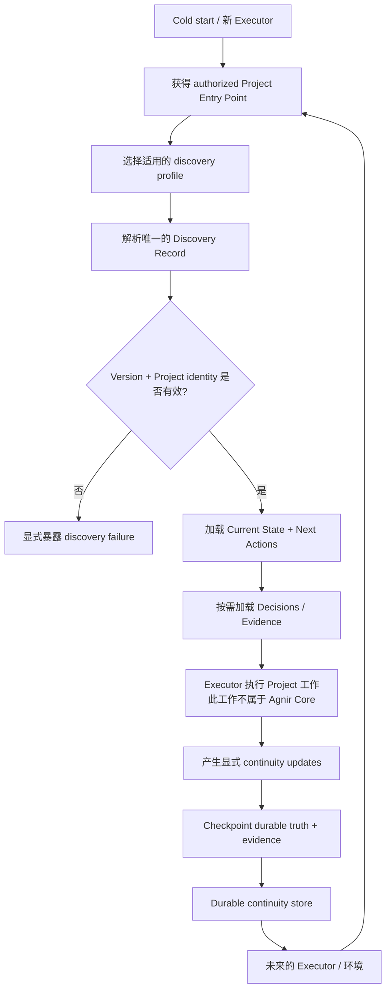

# Agnir

[English](README.md) | **简体中文**

Agnir 是一个 **由 Project 自己拥有的 durable continuity protocol（持久连续性协议）**。

它的目标是：即使 Executor、执行环境、存储实现或对话上下文发生变化，一个 Project 仍然可以被安全地恢复和继续。Durable continuity 属于 Project，而不属于某个 execution surface。

## 架构图（Architecture Diagram）



Agnir Core 定义 durable continuity 的语义和 discovery invariants；它**不要求** Git、GitHub、repository、ChatGPT 或任何特定 storage backend。Profiles/adapters 负责在具体 Project Entry Point 和存储环境中实现这些语义。

对本仓库而言，当前 realization 是 `repository-filesystem/0.1`：cold start 从 Project root 开始，解析顶层 `AGNIR.yaml`，校验 Project identity 和 Agnir 版本线，然后根据 manifest 中声明的 memory locators 找到持久状态。`AGNIR.yaml` 和 `.agnir/` 都是 profile/repository 层的选择，不是 Agnir Core 的普遍要求。

## 连续性流程（Continuity Flow）



Agnir 并不执行流程中间的 Project 工作。它负责让工作前后的 continuity 可以持久保存、被可靠发现、绑定到正确 Project，并能供未来环境安全恢复。Not-found、ambiguity、unsupported version、Project mismatch、authorization failure、cycle、stale locator 和 material inconsistency 等 discovery failures 都必须显式暴露，不能通过猜测静默修复。

## 当前版本线

`main` 实现 Agnir Core `0.1` development line。已发布的前身 PPMP v2.0.0 / Persistent Project Memory / Sandminni 保留在 `legacy/ppmp-v2.0.0`，不会被静默改名成 Agnir。

当前结构：

```text
AGNIR.yaml                     # repository/filesystem discovery anchor
.agnir/                        # 本 Project 的 authoritative colocated continuity
spec/AGNIR_CORE.md             # Core 0.1 working specification
spec/AGNIR_DISCOVERY.md        # cold-start discovery contract
spec/MIGRATION_PPMP_V2.md      # predecessor migration rules
profiles/REPOSITORY_FILESYSTEM.md
schemas/agnir-manifest.schema.json
conformance/                   # executable conformance pressure
history/PREDECESSOR.md         # predecessor lineage locator
```

前身版本中的 implementation/backend/adapter/site/template material 不再留在 active `main`，需要时从 legacy branch 查看。

## Core memory semantics

Agnir 要求能够持久恢复 Current State、Next Actions、Decisions 和 Evidence / Checkpoints。

Fresh Executor 只拿到 authorized Project Entry Point 时，也必须能够找到 Project 的 Discovery Record 和所需 durable state，而不依赖之前对话中的私有上下文。

## 与 Svif 的关系

Svif 是位于 `iorLab/svif` 的独立 **Project orchestration product**。当前 Svif 通过 Agnir adapter，把 Agnir 作为首个 Continuity Provider；但 Agnir 不依赖 Svif，也可以被其他产品或 Executor 独立使用。Svif 的 execution、delivery、provider、authority 等产品语义不属于 Agnir Core。

## 文档同步规则

`README.md` 与 `README.zh-CN.md` 是并行维护的项目入口。当 Agnir 的 layer model、discovery path、durable-memory semantics、Project boundary 或 continuity flow 发生变化时，**同一个 change set 必须同步更新两种语言 README 中受影响的架构图/流程图**。这些图表示当前架构与运行逻辑。

## Conformance

运行当前 self-hosting check：

```bash
python conformance/check_agnir_0_1.py
```
