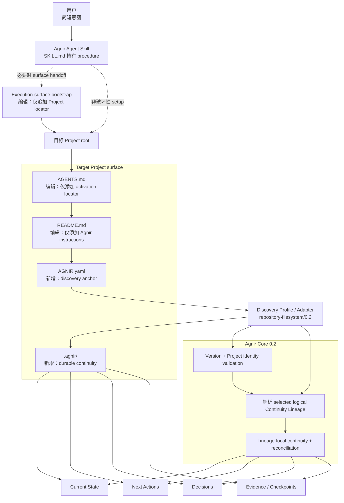
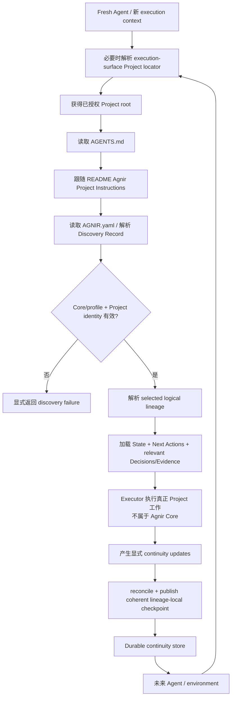

# Agnir

[English](README.md) | **简体中文**

Agnir 是一个**由 Project 自己拥有的持久连续性协议（project-owned durable continuity protocol）**。

它让一个 Project 在 Agent、对话、执行环境、存储实现或并行工作上下文发生变化时仍能安全继续。持久 continuity 属于 Project；execution surface 和 backend selector 都不是 canonical truth 的所有者。

**名称。** `Agnir` 来自冰岛语 `agnir`，是 `ögn` 的主格复数，含义接近“小颗粒 / 微小片段”。这与 Agnir 的模型相符：Project continuity 由少量、可发现的 Project truth 组成——Current State、Next Actions、Decisions 和 Evidence——新 Executor 可以依靠这些内容理解并继续 Project。

## 从这里开始

这一节面向用户。选择你要做的动作，然后只把对应的简短意图交给 Agent。

### 在新 Project 中安装 Agnir

```text
为这个 Project 安装并初始化 Agnir：https://github.com/iorLab/agnir
```

### 升级已有 Agnir Project

```text
把这个 Project 的 Agnir 升级到最新稳定版：https://github.com/iorLab/agnir
```

### 继续正常工作

**不需要再给 Agent 任何 Agnir bootstrap 提示词。** 给 Agent Project 访问权限，然后直接描述真正要做的任务即可。

某些 execution surface 需要一个**一次性的持久 Project locator**，fresh context 才能进入 Project 自己的 activation route。安装或升级时，Agnir Skill 必须在能力和权限允许时配置它；否则给用户一个**可直接复制的 handoff**。它必须把 surface activation 与 repository activation 分开报告，不能在必要的 **execution-surface configuration** 仍待完成时声称 full activation 已通过。这属于 execution-surface integration，不属于 Agnir Core，也不是 Project memory。

安装、迁移、升级或 repair 时，Agent 应把根目录 [`SKILL.md`](SKILL.md) 作为 canonical procedure。用户不需要携带 Agnir 的内部 checklist。

repository 初始化和任何必要的一次性 execution-surface configuration 完成后，一个 Agent-operable repository Project 会持久保留自己的 activation route：

```text
Project root
→ AGENTS.md
→ README.md / Agnir Project Instructions
→ AGNIR.yaml
→ selected durable continuity
```

`latest stable` 永远指实际发布的 non-prerelease tag/release，而不是移动中的 `main`、临时 release branch、RC 或未打 tag 的 commit。repository `v0.2.0` 只有在 immutable stable tag 和 Release 实际存在后，才作为 Core `0.2` / `repository-filesystem/0.2` 的稳定 product release 进入 stable-upgrade resolution。

## Agnir Project Instructions

> **给 Agent。** 普通用户通常不需要阅读这一节。

1. **Discover。** 把当前 repository root 当作已授权的 Project Entry Point。读取顶层 `AGNIR.yaml`，验证 Agnir Core/profile compatibility、Project identity；对于 Core `0.2`，还要验证 selected logical Continuity Lineage。如果存在 backend selector/binding，要把它和 lineage identity 分开验证。
2. **Load。** 从已声明的 selected continuity 加载 Current State 与 Next Actions；当 Decisions 与 Evidence 会实质约束当前操作时再加载。除非有更新的 Principal instruction 或直接观察到的当前 Project fact，否则 durable Project truth 优先于 chat history 或 Agent 私有记忆。
3. **Work。** 真正的 Project 工作发生在 Agnir Core 之外。安装、migration、upgrade 或 repair 时，根目录 `SKILL.md` 是 canonical Agent procedure。
4. **Checkpoint。** 在有意的 checkpoint、save-progress、收尾或 repository **commit boundary** 上，只 reconciliation selected lineage 中发生实质变化的 continuity。durable truth 未变化就是 no-op。material change 必须形成一个 coherent authoritative transition；stale-base publication 必须以 `AGNIR_CHECKPOINT_CONFLICT` 失败而不是覆盖更新 truth，随后 fresh discovery 验证发布结果。
5. **Commit / push。** 在 repository/VCS context 中，授权的 `commit`、`提交`、`提交代码` 或等价意图表示先 checkpoint 再 commit，并优先把 Project + Agnir 变化放进一个 revision。`commit and push`、`提交推送` 或等价意图还包括 push 和实际 destination ref verification。只有声称 authoritative publication 时才额外要求 destination 是声明的 authoritative ref。仅观察到外部 commit 只触发 checkpoint evaluation，不等于无条件 Agnir write。
6. **安全集成 lineages。** 对 Core `0.2` parallel continuity，source continuity 是 reconciliation input，不是 target truth。当 Agnir 控制 integration path 时，先在不推进 target 的情况下 stage candidate，再针对真实 integrated Project result reconciliation target continuity，最后把 integrated Project + reconciled target checkpoint coherent publication。

根目录 `AGENTS.md` 对 Agnir 来说故意只保存 locator；它不能成为第二份 Project state 或 Agnir procedure。canonical activation route 是：

`Project root -> AGENTS.md -> README.md / Agnir Project Instructions -> AGNIR.yaml -> declared durable memory`

activation locator、identity、lineage/binding、required memory locator 或 compatibility check 失败时，要显式暴露 failure，或在获得授权时 repair 最早出错层。不要发明 Project state，也不要静默 fallback 到 chat history、sibling repository、sibling branch 或退役 layout。

## Agnir 会给 Project 增加什么

reference Agnir Skill 初始化 repository/filesystem Project 时，会建立或验证一个很小的 **Project-owned continuity surface**。**Agnir 不会接管已有 Project 文件。** 对 `AGENTS.md` 与 `README.md`，Skill 只添加 Agnir 所需入口，同时保留无关的已有内容；其他 Agnir continuity artifacts 通常作为新的 Project-owned 文件增加。

```text
Project/
├── AGENTS.md                 # [编辑：仅添加入口] 添加 Agnir activation locator；保留原有 instructions
├── AGNIR.yaml                # [新增] discovery anchor：Project identity、compatibility、selected lineage、memory locators
├── README.md                 # [编辑：仅添加入口] 添加 ## Agnir Project Instructions；保留原有内容
└── .agnir/                   # [新增] Project-owned durable continuity
    ├── state.md              # [新增] selected lineage 的当前 durable truth
    ├── next-actions.md       # [新增] selected lineage 的未完成有序工作
    ├── decisions.md          # [新增] 约束未来工作的 durable decisions
    └── evidence/             # [新增] recovery、audit、reconciliation 或 material claim 所需 evidence/checkpoints
```

execution-surface configuration 不是 Project 文件，也不属于这棵 Project-owned tree。如果某个 surface 需要一次性持久设置——例如 ChatGPT Project Instructions——Skill 应**仅追加 Project locator**（或让用户追加），并保留无关的 surface instructions。**Execution-surface bootstrap** 只指向 Project；Project 自己的 `AGENTS.md → README → AGNIR.yaml` route 仍然 canonical。

`AGNIR.yaml` locator 是 authoritative；上面的 `.agnir/` 是该 profile 推荐的 colocated layout，而不是通用 Agnir Core 强制要求。

## 架构图



`SKILL.md` 是 Agent-facing packaging layer；`AGENTS.md → README` 是 Agent-operable repository activation convention。Execution-surface bootstrap 是独立 adapter concern：surface 无法自动抵达 Project 时，只保存进入这条 route 所需的最小持久 locator 信息。它们都不是 Agnir Core dependency。

Core `0.2` 引入显式 **Continuity Lineage**，但不会把 Git 或 branch name 变成 Core 概念：

```text
Project identity
      │
      ├── logical Continuity Lineage A ── 由 backend context A 选择/绑定
      │        └── checkpoints / receipts
      │
      └── logical Continuity Lineage B ── 由 backend context B 选择/绑定
               └── checkpoints / receipts
```

在 VCS-backed Project 中，branch/ref/worktree 是 selector/binding，**不会自动等于 lineage identity**。commit SHA 可以是 checkpoint receipt，但不是 lineage identity。Agnir-aware lineage fork、rename/rebind 与 integration 都必须保留这些区别。

### Integration publication

Agnir 控制 source→target lineage integration 时，安全顺序是：

```text
capture target + source receipts
→ stage integrated Project candidate，target 保持不动
→ reconcile target continuity
→ construct target checkpoint
→ 一起 publish integrated Project + reconciled target continuity
→ fresh-resolve target 与 source
```

source State/Next Actions/Decisions/Evidence 都只是 reconciliation input，永远不会自动变成 target truth。

## Skill packaging boundary

Agnir 刻意把用户意图和 Agent procedure 分开：

- **用户请求**保持简短：安装、升级或继续真正的任务。
- **Agent procedure** 位于根目录 `SKILL.md`，负责 install / initialize / migration / upgrade / resume / checkpoint / commit / push / integration / repair。

Skill 是 distribution 和 operational entry surface，不改变 Agnir Core semantics。初始化后，目标 Project 通过自己的 `AGENTS.md` → README → `AGNIR.yaml` activation/discovery route 自描述。

当 execution surface 本身需要 persistent configuration 才能抵达 Project 时，Skill 把它当成一次性 surface handoff：保留无关 surface instructions，只写 locator，并把 surface activation 与 repository activation 分开报告。

对于 stable install/upgrade 请求，Skill 解析实际发布的 stable release。Principal 仍可显式授权 prerelease target，但 prerelease 不能静默替代 stable resolution。

## 连续性流程

安装和任何必要的一次性 execution-surface configuration 完成后，正常 Project continuity 不依赖最初的安装 prompt 或安装对话：



Agnir 不负责流程中间的真正 Project 工作。它让 continuity 持久、可发现、归属于正确 Project 和 selected lineage，并可安全 resume。not-found、ambiguity、unsupported version、Project mismatch、authorization failure、lineage/binding failure、cycle、stale locator 与 material inconsistency 等错误必须显式暴露，不能靠猜测静默修复。

## Compatibility 与 migration

Core/profile compatibility line 是显式 contract：

- 已发布 `v0.1.1` 使用 Core `0.1` + `repository-filesystem/0.1`；
- repository `v0.2.0` 使用 stable Core `0.2` + `repository-filesystem/0.2`。

一个 `0.1` Project 原本的单一隐式 continuity line 要迁移成恰好一个初始/default `0.2` logical lineage。Migration 要保留 `project.identity`、durable continuity 和适用的 memory locators；不能把 compatibility change 静默当成 operational upgrade。详见 [`spec/CORE_0_1_TO_0_2_MIGRATION.md`](spec/CORE_0_1_TO_0_2_MIGRATION.md)。

Core/profile `0.1` contract 与 conformance 仍保留在仓库中，作为 compatibility 和 migration surface。

## Active line 与 release status

当前 active protocol line 是 Core `0.2` + `repository-filesystem/0.2`。repository SemVer `0.2.0` 在 immutable `v0.2.0` non-prerelease Release 实际发布后，成为这条 line 的 stable product release。

release branch 使用自己的 logical lineage 与 selector binding；authoritative `main` 使用 `urn:agnir:lineage:authoritative`。这些 lineage identity 都不等于 branch name。

版本层必须保持区分：

- repository release：`0.2.0`；
- Core compatibility：`0.2`；
- repository/filesystem profile：`repository-filesystem/0.2`。

[`RELEASE.md`](RELEASE.md) 记录 stable publication contract 与 release evidence。已发布 tag 按 Project policy 必须保持 immutable。

## 仓库结构

```text
agnir/
├── spec/                              # protocol contracts 与 migration
│   ├── AGNIR_CORE.md                  # Core 0.1 compatibility contract
│   ├── AGNIR_CORE_0_2.md              # stable Core 0.2 normative contract
│   ├── AGNIR_DISCOVERY.md             # discovery / Locator Chain / failures
│   └── CORE_0_1_TO_0_2_MIGRATION.md   # 显式 compatibility migration
├── profiles/
│   ├── REPOSITORY_FILESYSTEM.md       # repository-filesystem/0.1
│   ├── REPOSITORY_FILESYSTEM_0_2.md   # stable repository-filesystem/0.2
│   └── VCS_BRANCH_CONTINUITY.md       # VCS mapping/extension pressure
├── schemas/                           # 0.1 + 0.2 manifest schemas
├── conformance/
│   ├── check_agnir_0_1.py             # Core/profile 0.1 compatibility helpers
│   ├── check_agnir_0_2.py             # stable Core/profile 0.2 self-host gate
│   ├── check_agnir_0_2_rc.py          # 已发布 RC 的 audit/reference gate
│   ├── activation_reference.py        # AGENTS → README activation resolver
│   ├── checkpoint_reference.py        # coherent/no-op/conflict checkpoint model
│   ├── test_skill_package.py          # Skill / user UX / handoff pressure
│   ├── test_stable_release_gates.py   # stable package/install/migration pressure
│   └── test_*.py                      # backend、lineage、migration、integration pressure
├── .agnir/                            # 本 Project 的 canonical durable continuity
├── history/                           # predecessor 历史材料
├── .github/                           # CI workflows
├── SKILL.md                           # canonical Agent-facing procedure
├── AGENTS.md                          # 指向 README Project instructions 的 locator
├── AGNIR.yaml                         # selected Project/lineage discovery anchor
├── README.md
├── README.zh-CN.md
├── REPOSITORY_TREE.md                 # 完整 tracked-file responsibility map
├── RELEASE.md                         # release publication contract/evidence
└── VERSION                            # repository SemVer
```

完整 tracked-file map 见 **[REPOSITORY_TREE.md](REPOSITORY_TREE.md)**。

## Core memory semantics

Agnir 要求 selected continuity 的 Current State、Next Actions、Decisions 与 Evidence / Checkpoints 可被 durable recovery。fresh compatible Executor 必须无需 predecessor-private conversational context 就能恢复继续 Project 所需 truth。

## 与 Svif 的关系

Agnir 与 Svif 是两个独立产品。Agnir 负责 durable Project continuity semantics；Svif 可以通过 Continuity Provider 或 adapter 使用 Agnir，但 Agnir 不依赖 Svif。

## Scope

Agnir Core 对 Git、GitHub、repository、filesystem、ChatGPT、具体 Agent 产品和 storage engine 保持中立。repository/filesystem 行为、VCS mapping、execution-surface handoff 与 Agent Skill packaging 都属于围绕 Core contract 的 profile / adapter / distribution 层。
