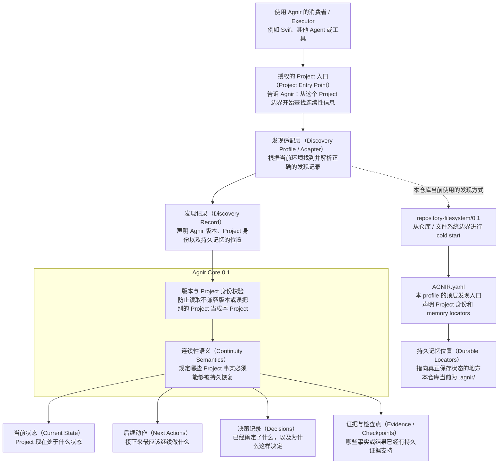
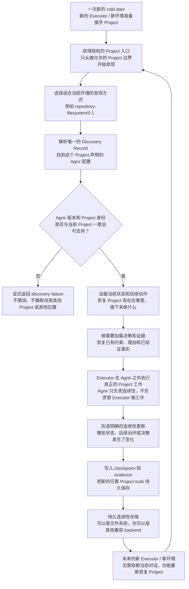

# Agnir

[English](README.md) | **简体中文**

Agnir 是一个 **由 Project 自己拥有的 durable continuity protocol（持久连续性协议）**。

它的目标是：即使 Executor、执行环境、存储实现或对话上下文发生变化，一个 Project 仍然可以被安全地恢复和继续。Durable continuity 属于 Project，而不属于某个 execution surface。

## 架构图（Architecture Diagram）



Agnir Core 定义 durable continuity 的语义和 discovery invariants；它**不要求** Git、GitHub、repository、ChatGPT 或任何特定 storage backend。Profiles/adapters 负责在具体 Project Entry Point 和存储环境中实现这些语义。

对本仓库而言，当前 realization 是 `repository-filesystem/0.1`：cold start 从 Project root 开始，解析顶层 `AGNIR.yaml`，校验 Project identity 和 Agnir 版本线，然后根据 manifest 中声明的 memory locators 找到持久状态。`AGNIR.yaml` 和 `.agnir/` 都是 profile/repository 层的选择，不是 Agnir Core 的普遍要求。

## 连续性流程（Continuity Flow）



Agnir 并不执行流程中间的 Project 工作。它负责让工作前后的 continuity 可以持久保存、被可靠发现、绑定到正确 Project，并能供未来环境安全恢复。Not-found、ambiguity、unsupported version、Project mismatch、authorization failure、cycle、stale locator 和 material inconsistency 等 discovery failures 都必须显式暴露，不能通过猜测静默修复。

## 当前版本线

`main` 实现 Agnir Core `0.1` development line。已发布的前身 PPMP v2.0.0 / Persistent Project Memory / Sandminni 保留在 `legacy/ppmp-v2.0.0`，不会被静默改名成 Agnir。

## 仓库结构

下面这棵树就是仓库的实用导航。它重点解释“协议定义在哪里、具体 profile 在哪里、conformance 怎么验证、这个 Project 自己的连续性状态在哪里”，不会穷举每一个测试或 evidence 文件。

```text
agnir/
├── spec/                              # 协议层定义；这里不绑定具体存储或执行环境
│   ├── AGNIR_CORE.md                  # Core 0.1：durable continuity 的核心语义和 invariants
│   ├── AGNIR_DISCOVERY.md             # cold start、Locator Chain、Project identity 和 failure semantics
│   └── MIGRATION_PPMP_V2.md           # predecessor → Agnir 的显式迁移要求
│
├── profiles/                          # Core 之外的具体 discovery / storage realization
│   └── REPOSITORY_FILESYSTEM.md       # 当前 repository-filesystem/0.1 profile
├── schemas/                           # 具体 profile artifact 的机器可读 serialization
│   └── agnir-manifest.schema.json     # 当前 AGNIR.yaml manifest 的 JSON Schema
│
├── conformance/                       # 用可执行测试给 Core / profile 施加一致性压力
│   ├── check_agnir_0_1.py             # self-hosting cold start + active repository 结构检查
│   ├── *_reference.py                 # 仅用于 conformance 的可执行参考模型，不是 production implementation
│   └── test_*.py                      # failure、backend、authorization、isolation、boundary 等 fixtures
│
├── .agnir/                            # 这个 Agnir Project 自己的 canonical durable continuity
│   ├── state.md                       # 当前 Project 状态
│   ├── next-actions.md                # 下次恢复时继续做什么
│   ├── decisions.md                   # 已确定的协议 / 项目决策及理由
│   └── evidence/                      # checkpoint 与 conformance evidence
│
├── history/                           # 前身 lineage；只作历史，不属于 active protocol structure
│   └── PREDECESSOR.md                 # 指向 PPMP / Persistent Project Memory / Sandminni 前身历史
├── .github/workflows/                 # CI：运行 self-hosting 与完整 conformance
├── AGNIR.yaml                         # 本仓库的 repository-filesystem discovery anchor；不是 Core 的普遍要求
├── README.md                          # 英文项目入口
├── README.zh-CN.md                    # 简体中文项目入口
└── VERSION                            # 当前 Agnir development version
```

需要查看当前 `main` 的**完整文件级展开**（包含每个 tracked 文件及其职责说明），请看 **[完整目录树：REPOSITORY_TREE.md](REPOSITORY_TREE.md)**。

前身版本中的 implementation/backend/adapter/site/template material 不再留在 active `main`，需要时从 legacy branch 查看。

## Core memory semantics

Agnir 要求能够持久恢复 Current State、Next Actions、Decisions 和 Evidence / Checkpoints。

Fresh Executor 只拿到 authorized Project Entry Point 时，也必须能够找到 Project 的 Discovery Record 和所需 durable state，而不依赖之前对话中的私有上下文。

## 与 Svif 的关系

Svif 是位于 `iorLab/svif` 的独立 **Project orchestration product**。当前 Svif 通过 Agnir adapter，把 Agnir 作为首个 Continuity Provider；但 Agnir 不依赖 Svif，也可以被其他产品或 Executor 独立使用。Svif 的 execution、delivery、provider、authority、distribution 等产品语义不属于 Agnir Core。

## 文档同步规则

`README.md` 与 `README.zh-CN.md` 是并行维护的项目入口。当 Agnir 的 layer model、discovery path、durable-memory semantics、Project boundary 或 continuity flow 发生变化时，**同一个 change set 必须同步更新两种语言 README 中受影响的架构图/流程图**。这些图表示当前架构与运行逻辑。

纯文本的**仓库结构树**继续作为快速导航，保持简洁；完整文件级结构则由 **`REPOSITORY_TREE.md`** 维护。只要 tracked 文件被新增、删除、移动，或者职责发生实质变化，必须在同一个 change set 中更新 `REPOSITORY_TREE.md`；如果变化也影响 README 的简略树，则中英文 README 必须同时更新。

中文版图表还有一条额外规则：**每个节点必须优先说明“这是什么、在 Agnir 中负责什么”，英文术语仅作为括注或正式标识保留；中文读者不应先理解英文术语才能读懂图。**

## Conformance

运行本仓库的 self-hosting 结构检查，以及完整的可执行压力测试：

```bash
python conformance/check_agnir_0_1.py
python -m unittest discover -s conformance -p 'test_*.py' -v
```

当前测试覆盖：repository/filesystem cold start 与显式 discovery failures、持久化的非 repository SQLite realization、无明文凭据的 external-memory authorization、多 Project 的 locator-only workspace isolation、通用 Locator Chain 的 cycle / stale / inconsistency 语义、symlink 边界行为，以及真实 Git worktree cold start。

真实 mount boundary 目前仍明确属于**未证明**项；只有在能够创建真实 mount 的测试环境中验证后才能声称覆盖，不能拿普通目录模拟 mount 来充当证据。
