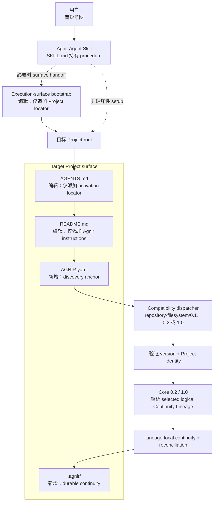
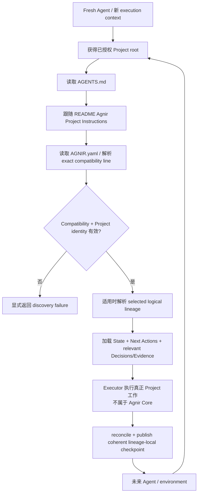

# Agnir

[English](README.md) | **简体中文**

Agnir 是一个**由 Project 自己拥有的持久连续性协议（project-owned durable continuity protocol）**。它让 Project 在 Agent、对话、执行环境、存储实现或并行工作上下文变化时仍能安全继续。持久 continuity 属于 Project；execution surface 与 backend selector 都不是 canonical truth 的所有者。

**名称。** `Agnir` 来自冰岛语 `agnir`，是 `ögn` 的主格复数，含义接近“小颗粒 / 微小片段”。Project continuity 由少量可发现的 Project truth 组成：Current State、Next Actions、Decisions 与 Evidence。

## 从这里开始

这一节面向用户。只把你真正想做的简短意图交给 Agent。

### 在新 Project 中安装 Agnir

```text
为这个 Project 安装并初始化 Agnir：https://github.com/iorLab/agnir
```

### 升级已有 Agnir Project

```text
把这个 Project 的 Agnir 升级到最新稳定版：https://github.com/iorLab/agnir
```

### 继续正常工作

**不需要再给 Agent 任何 Agnir bootstrap 提示词。** 给 Agent Project 访问权限，然后直接描述真正任务即可。

某些 execution surface 需要一个**一次性的持久 Project locator**，fresh context 才能进入 Project 自己的 activation route。安装或升级时，Agnir Skill 必须在已授权且具备能力时配置它，否则给用户一个**可直接复制的 handoff**。它必须把 repository activation 与 **execution-surface configuration** 分开报告。

**Execution-surface bootstrap** 必须**仅追加 Project locator**，并保留无关的 surface instructions。安装、migration、compatibility promotion、upgrade 或 repair 时，根目录 [`SKILL.md`](SKILL.md) 是 canonical Agent procedure。

repository Project 会持久保留自己的 activation route：

```text
Project root
→ AGENTS.md
→ README.md / Agnir Project Instructions
→ AGNIR.yaml
→ selected durable continuity
```

`latest stable` 永远指实际发布的 non-prerelease tag/Release，而不是移动中的 `main`、临时 release branch、RC 或未打 tag 的 commit。当前源码树承载 repository `1.0.0` stable package；只有当 non-prerelease `v1.0.0` Release 在 exact authoritative revision 上成功发布后，普通 stable-upgrade resolution 才会选择它。已接受的 `v1.0.0-rc.1` 仍只是 prerelease evidence。

## Agnir Project Instructions

> **给 Agent。** 普通用户通常不需要阅读这一节。

1. **Discover。** 把 repository root 当作已授权的 Project Entry Point。读取顶层 `AGNIR.yaml`，验证实际声明的 Core/profile compatibility 与 Project identity；对 Core `0.2` 或 `1.0`，还要验证 selected logical Continuity Lineage。backend selector/binding 与 lineage identity 必须分开验证，并按 Project 实际声明的 compatibility line dispatch。
2. **Load。** 从 declared selected continuity 加载 Current State 与 Next Actions；当 Decisions/Evidence 会实质约束当前操作时再加载。除非有更新的 Principal instruction 或直接观察到的 Project fact，否则 durable Project truth 优先于私有对话记忆。
3. **Work。** 真正的 Project 工作发生在 Agnir Core 之外。安装、migration、compatibility promotion、upgrade 或 repair 时使用根目录 `SKILL.md`。
4. **Checkpoint。** 在 intentional checkpoint、save-progress、finish 或 repository **commit boundary** 上，只 reconciliation selected lineage 中发生实质变化的 continuity。durable truth 未变化就是 no-op；stale-base publication 必须以 `AGNIR_CHECKPOINT_CONFLICT` 失败，而不是覆盖更新 truth。
5. **Commit / push。** 在 repository context 中，`commit`、`提交代码` 或等价意图表示先 checkpoint 再 commit，并优先用一个 revision 同时承载 Project + Agnir 变化。`commit and push`、`提交推送` 或等价意图还包括 push 和 destination-ref verification。
6. **安全集成 lineages。** 对 Core `0.2`/`1.0` parallel continuity，source continuity 是 reconciliation input，不是 target truth。Agnir 控制 integration path 时，先 stage 且不推进 target，再针对 integrated Project result reconciliation target continuity，最后 coherent publication integrated Project + reconciled target checkpoint。

根目录 `AGENTS.md` 故意只作为 locator，不能成为第二份 Project state 或 Agnir procedure。

## Agnir 会给 Project 增加什么

reference Agnir Skill 初始化 repository/filesystem Project 时，只建立一个很小的 Project-owned continuity surface。**Agnir 不会接管已有 Project 文件。** 对 `AGENTS.md` 与 `README.md`，Skill 只增加所需入口并保留无关内容。

```text
Project/
├── AGENTS.md                 # [编辑：仅添加入口] 添加 activation locator；保留原有 instructions
├── AGNIR.yaml                # [新增] discovery anchor：identity、compatibility、lineage、memory locators
├── README.md                 # [编辑：仅添加入口] 添加 Agnir instructions；保留原有内容
└── .agnir/                   # [新增] Project-owned durable continuity
    ├── state.md              # [新增] 当前 durable truth
    ├── next-actions.md       # [新增] ordered outstanding work
    ├── decisions.md          # [新增] durable decisions
    └── evidence/             # [新增] recovery/audit/reconciliation evidence
```

execution-surface configuration 不是 Project 文件。`AGNIR.yaml` locator 是 authoritative；上面的 `.agnir/` 是该 profile 推荐的 colocated layout，不是通用 Agnir Core 强制存储结构。

## 架构图



`SKILL.md`、`AGENTS.md → README` 与 execution-surface bootstrap 都是围绕 Core 的 packaging/activation convention，不是 Core dependency。

Core `0.2` 引入显式 **Continuity Lineage**；Core `1.0` 把已经通过独立实现验证的同一语义模型稳定化。Project identity、logical lineage identity、selector/binding 与 revision receipt 始终分开。

## Skill packaging boundary

Skill 把简短用户意图与完整 Agent procedure 分开。stable install/upgrade 解析实际发布的 stable release；prerelease 只有在 Principal 显式授权时才能选择。`1.0.x` distribution 可以继续支持仍声明 Core/profile `0.1` 或 `0.2` 的 Project；安装新 distribution 本身不等于授权改写其 compatibility identifier。

## 连续性流程



Agnir 不负责真正 Project 工作。它让 continuity 持久、可发现、归属于正确 Project/lineage，并可安全 resume。discovery failure 必须显式暴露，不能靠猜测静默修复。

## Compatibility 与 migration

支持的 compatibility line 仍然是显式 contract：

- 已发布 `v0.1.1`：Core `0.1` + `repository-filesystem/0.1`；
- 已发布 `v0.2.0`：Core `0.2` + `repository-filesystem/0.2`；
- repository stable package `v1.0.0`：Core `1.0` + `repository-filesystem/1.0`，同时继续携带并测试历史 `0.1`/`0.2` compatibility path。

`0.1` Project 按 [`spec/CORE_0_1_TO_0_2_MIGRATION.md`](spec/CORE_0_1_TO_0_2_MIGRATION.md) 显式迁移到 `0.2`。Core/profile `1.0` 是**对已经在 `0.2` 下通过独立实现验证的行为进行稳定性 promotion**，不是 feature-driven redesign。已有 `0.2` Project 可以继续保持 `0.2`；把 declaration 改成 `1.0` 是另一项必须单独授权、由 Project 自己拥有的 promotion，规范见 [`spec/CORE_0_2_TO_1_0_PROMOTION.md`](spec/CORE_0_2_TO_1_0_PROMOTION.md)。

## Active line 与 release status

**Repository stable package：`v1.0.0`** — Core `1.0` + `repository-filesystem/1.0`。

**已接受 release candidate：`v1.0.0-rc.1`**，exact revision `092945289f1a0a9803e4fe0583104aa380ceaadc`；immutable RC cycle 已通过 initial publication 与 fresh-source verification。

stable publication 是独立的 authoritative-main 操作。`release/v1.0.0` staging lineage 只提供 reconciliation input；只有 exact authoritative `main` 在完整 target verification 通过后才能 arm publication。

```text
Agnir repository v1.0.0
├── Core 1.0
└── repository-filesystem/1.0
```

已有 Core/profile `0.1` 与 `0.2` Project 继续受支持。repository release version、Core compatibility version、profile version、logical lineage identity、selector 与 revision receipt 都是不同概念。

[`RELEASE.md`](RELEASE.md) 说明 stable package 与 exact publication invariant；[`V1_RELEASE_CRITERIA.md`](V1_RELEASE_CRITERIA.md) 定义 v1 stability gate。已发布 tag 按 Project policy 保持 immutable。

## 仓库结构

```text
agnir/
├── spec/                                  # Core/discovery/migration/promotion contracts
│   ├── AGNIR_CORE.md                      # Core 0.1 compatibility
│   ├── AGNIR_CORE_0_2.md                  # stable Core 0.2
│   ├── AGNIR_CORE_1_0.md                  # stable Core 1.0
│   ├── AGNIR_DISCOVERY.md
│   ├── CORE_0_1_TO_0_2_MIGRATION.md
│   └── CORE_0_2_TO_1_0_PROMOTION.md
├── profiles/                              # repository/filesystem compatibility profiles
├── conformance/
│   ├── activation_reference.py
│   ├── checkpoint_reference.py
│   ├── check_agnir_1_0.py
│   ├── test_skill_package.py
│   └── test_*.py
├── .agnir/                                # 本 Project 的 canonical durable continuity
├── history/                               # predecessor/history material
├── SKILL.md                               # canonical Agent-facing procedure
├── AGENTS.md                              # Project instructions locator
├── AGNIR.yaml                             # Project/lineage discovery anchor
├── README.md
├── README.zh-CN.md
├── REPOSITORY_TREE.md                     # exhaustive responsibility map
├── RELEASE.md                             # stable package/publication contract
├── RELEASE_MILESTONES.md
├── VERSIONING.md
└── VERSION                                # repository source-package SemVer
```

完整 tracked-file map 见 **[REPOSITORY_TREE.md](REPOSITORY_TREE.md)**。

## Core memory semantics

Agnir 要求 selected continuity 能持久恢复 Current State、Next Actions、Decisions 与 Evidence / Checkpoints。fresh compatible Executor 必须能在没有 predecessor-private conversation context 的情况下恢复安全继续 Project 所需的 truth。

## 与 Svif 的关系

Agnir 与 Svif 是两个独立产品。Agnir 负责 durable Project continuity semantics；Svif 可以通过 Continuity Provider 或 adapter 消费 Agnir，但 Agnir 不依赖 Svif。

## Scope

Agnir Core 对 Git、GitHub、repository、filesystem、ChatGPT、具体 Agent 产品与 storage engine 保持中立。repository/filesystem behavior、VCS mapping、execution-surface handoff 与 Agent Skill packaging 都是围绕 Core contract 构建的 profile/adapter/distribution concern。
