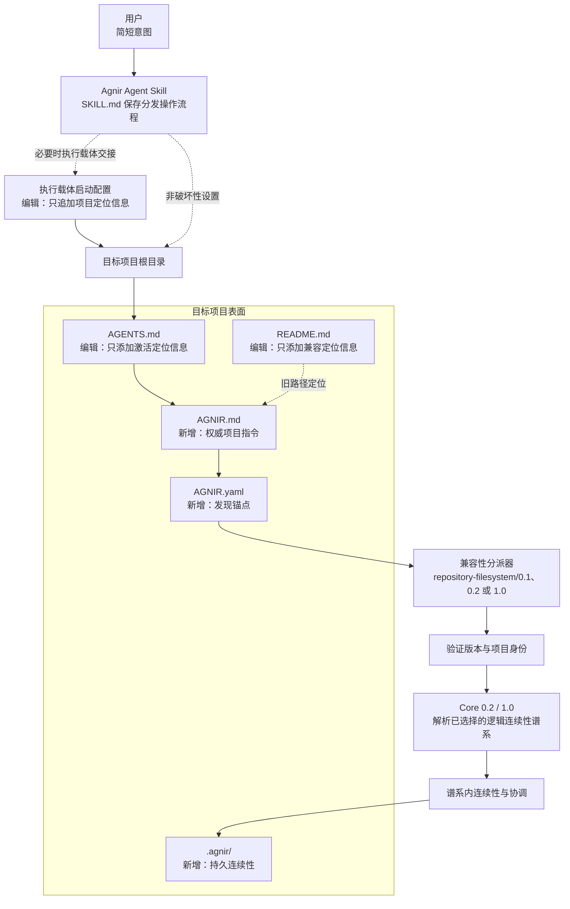
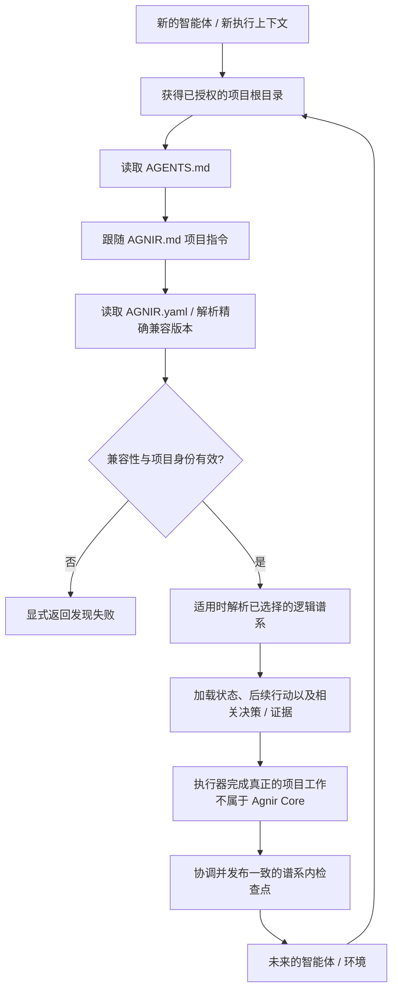

# Agnir

<p align="center">
  <picture>
    <source media="(prefers-color-scheme: dark)" srcset="brand/exports/agnir-horizontal-dark.svg">
    <source media="(prefers-color-scheme: light)" srcset="brand/exports/agnir-horizontal-light.svg">
    
  </picture>
</p>

<p align="center"><strong>由项目自己拥有的持久连续性。</strong></p>

[English](README.md) | **简体中文**

Agnir 是一个**由项目自己拥有的持久连续性协议**。当智能体、对话、执行环境、存储实现或并行工作上下文发生变化时，它让项目仍能安全继续。持久连续性属于项目；执行载体和后端选择器都不是权威事实的所有者。

**名称。** `Agnir` 来自冰岛语 `agnir`，是 `ögn` 的主格复数，含义接近“微小颗粒 / 微小片段”。项目连续性由少量可发现的项目事实组成：当前状态、后续行动、决策与证据。

## 品牌识别

Agnir 是 Svif × Agnir 家族识别中的**结构层**：由暖沙色 / 矿物色、颗粒、几何结构和中央锚点构成。由颗粒组成的 **A** 与产品本身表达同一个概念——持久的项目事实不是一个不可解释的大型“记忆块”，而是一组可发现、可归属、可恢复并可安全协调的事实片段。

已经批准的 Agnir 品牌识别系统现已成为 `main` 上的权威品牌资产。生产级矢量母版位于 [`brand/masters/`](brand/masters/)，PNG、应用图标与网站图标交付文件位于 [`brand/exports/png/`](brand/exports/png/)，锁定的视觉规范与使用规则分别见 [`brand/APPROVED-VISUAL-REFERENCE.md`](brand/APPROVED-VISUAL-REFERENCE.md) 和 [`brand/brand-handoff.md`](brand/brand-handoff.md)。品牌视觉属于产品展示层，不是 Agnir Core 的语义依赖。

## 从这里开始

<!--
机器兼容标记：以下内容仅供既有 self-host conformance 做非渲染字面兼容，不是面向用户的双语文案。
```text
为这个 Project 安装并初始化 Agnir：https://github.com/iorLab/agnir
```
```text
把这个 Project 的 Agnir 升级到最新稳定版：https://github.com/iorLab/agnir
```
不需要再给 Agent 任何 Agnir bootstrap 提示词。
一次性的持久 Project locator
可直接复制的 handoff
execution-surface configuration
Execution-surface bootstrap
仅追加 Project locator
-->

这一节面向用户。只把你真正想做的简短意图交给智能体。

### 在新项目中安装 Agnir

```text
为这个项目安装并初始化 Agnir：https://github.com/iorLab/agnir
```

### 升级已有 Agnir 项目

```text
把这个项目的 Agnir 升级到最新稳定版：https://github.com/iorLab/agnir
```

### 继续正常工作

**不需要反复提供 Agnir 启动提示词。** 给智能体项目访问权限，然后直接描述真正的任务即可。

某些执行载体需要一个**一次性的持久项目定位信息**，新的上下文才能进入项目自己的激活路径。安装或升级时，Agnir Skill 必须在获得授权且具备能力时配置该载体，否则给用户一个**可直接复制的交接内容**。它必须把**执行载体激活**与**仓库激活**分开报告。执行载体配置属于适配层行为，不属于 Agnir Core 或项目记忆。

**执行载体启动配置**必须**只追加项目定位信息**，并保留与 Agnir 无关的既有指令。安装、迁移、兼容性晋升、升级或修复时，根目录 [`SKILL.md`](SKILL.md) 是面向智能体的权威分发操作流程。

仓库型项目会持久保存自己的激活路径：

```text
项目根目录
→ AGENTS.md
→ AGNIR.md
→ AGNIR.yaml
→ 已选择的持久连续性
```

`AGNIR.md` 是面向 Executor 的权威激活与项目操作入口。`README.md#Agnir-Project-Instructions` 只作为 Agnir `1.0.0` 旧激活路径的向后兼容定位入口保留。

`latest stable` 永远指实际发布的非预发布 tag / Release，而不是移动中的 `main`、临时 release 分支、RC 或未打 tag 的提交。当前最新已发布稳定包仍是 `v1.0.0`；`v1.0.1` 的激活加固在单独完成正式发布前只是向后兼容的 patch 演进。稳定版升级解析只有在对应非预发布 Release 于精确权威修订上成功发布后才会前进。

## Agnir 项目指令
<!-- ## Agnir Project Instructions -->

权威 Agnir 激活与项目操作指令位于 [`AGNIR.md`](AGNIR.md)。本节标题仅作为旧 Agnir `1.0.0` 激活路径的向后兼容定位入口保留，不再复制完整操作流程。

## Agnir 会给项目增加什么
<!-- ## Agnir 会给 Project 增加什么 -->
<!--
机器兼容标记，不渲染：
Agnir 不会接管已有 Project 文件。
保留原有 instructions
保留原有内容
-->

参考 Agnir Skill 初始化仓库 / 文件系统项目时，只建立一个很小的、由项目自己拥有的连续性表面。**Agnir 不会接管已有项目文件。** 对现有项目文件，Skill 只增加所需入口并保留无关内容。

```text
Project/
├── AGENTS.md                 # [编辑：仅添加入口] 添加到 AGNIR.md 的定位信息；保留现有指令
├── AGNIR.md                  # [新增] 面向 Executor 的权威激活 + 项目操作指令
├── AGNIR.yaml                # [新增] 发现锚点：身份、兼容性、谱系、记忆定位信息
├── README.md                 # [编辑：仅添加入口] 添加向后兼容定位信息；保留现有内容
└── .agnir/                   # [新增] 由项目自己拥有的持久连续性
    ├── state.md              # [新增] 当前持久事实
    ├── next-actions.md       # [新增] 按顺序排列的后续工作
    ├── decisions.md          # [新增] 持久决策
    └── evidence/             # [新增] 恢复 / 审计 / 协调证据
```

执行载体配置不是项目文件。`AGNIR.yaml` 中的定位信息具有权威性；上面的 `.agnir/` 是该 profile 推荐的同址布局，不是通用 Agnir Core 强制要求的存储结构。

## 架构图
<!--
机器兼容标记，不渲染：
非破坏性 setup
编辑：仅添加 activation locator
编辑：仅添加 Agnir instructions
新增：discovery anchor
新增：durable continuity
-->



`SKILL.md`、`AGENTS.md → AGNIR.md`、README 向后兼容定位入口与执行载体启动配置都属于围绕 Core 的打包 / 激活约定，不是 Core 依赖。

Core `0.2` 显式引入了**连续性谱系**；Core `1.0` 将已经通过独立实现验证的同一语义模型稳定化。项目身份、逻辑谱系身份、selector / binding 与修订回执始终是不同概念。
<!-- 机器兼容术语，不渲染：Continuity Lineage -->

## Skill 打包边界

Skill 把简短用户意图与完整智能体操作流程分开。稳定版安装 / 升级只解析实际发布的稳定 Release；只有 Principal 明确授权时才能选择预发布目标。`1.0.x` 分发包可以继续支持仍声明 Core / profile `0.1` 或 `0.2` 的项目；安装新分发包本身不等于授权改写其兼容性标识。

## 连续性流程



Agnir 不负责真正的项目工作。它让连续性持久、可发现、归属于正确的项目 / 谱系，并且可以安全恢复。发现失败必须显式暴露，不能靠猜测静默修复。

## 兼容性与迁移

支持的兼容版本始终是显式契约：

- 已发布 `v0.1.1`：Core `0.1` + `repository-filesystem/0.1`；
- 已发布 `v0.2.0`：Core `0.2` + `repository-filesystem/0.2`；
- 已发布 `v1.0.0`：Core `1.0` + `repository-filesystem/1.0`，同时继续携带并测试历史 `0.1` / `0.2` 兼容路径。

`0.1` 项目按照 [`spec/CORE_0_1_TO_0_2_MIGRATION.md`](spec/CORE_0_1_TO_0_2_MIGRATION.md) 显式迁移到 `0.2`。Core / profile `1.0` 是**对已经在 `0.2` 下通过独立实现验证的行为进行稳定性晋升**，不是功能驱动的重新设计。已有 `0.2` 项目可以继续保持 `0.2`；把声明改成 `1.0` 是另一项必须单独授权、由项目自己拥有的晋升操作，规范见 [`spec/CORE_0_2_TO_1_0_PROMOTION.md`](spec/CORE_0_2_TO_1_0_PROMOTION.md)。

## 当前版本与发布状态
<!-- 机器兼容发布标记，不渲染：Repository stable package：`v1.0.0` | 已接受 release candidate：`v1.0.0-rc.1` -->

**最新已发布稳定包：`v1.0.0`** — Core `1.0` + `repository-filesystem/1.0`。

**正在开发的 patch 演进：`v1.0.1`** — 仅加固 activation / packaging 可靠性；Core `1.0` 与 `repository-filesystem/1.0` 不变。

**1.0 稳定线已接受的发布候选版：`v1.0.0-rc.1`**，精确修订为 `092945289f1a0a9803e4fe0583104aa380ceaadc`；不可变 RC 周期已经通过首次发布与新鲜源码验证。

稳定版发布是独立的权威 `main` 操作。release 暂存谱系只提供协调输入；只有精确的权威 `main` 在完整目标验证通过后才能准备发布。

```text
Agnir repository 1.0.x
├── Core 1.0
└── repository-filesystem/1.0
```

已有 Core / profile `0.1` 与 `0.2` 项目继续受支持。仓库发布版本、Core 兼容版本、profile 版本、逻辑谱系身份、selector 与修订回执都是不同概念。

[`RELEASE.md`](RELEASE.md) 说明稳定包与精确发布不变量；[`V1_RELEASE_CRITERIA.md`](V1_RELEASE_CRITERIA.md) 定义 v1 稳定性门槛。已发布 tag 按项目策略保持不可变。

## 仓库结构

```text
agnir/
├── spec/                                  # Core / 发现 / 迁移 / 晋升契约
│   ├── AGNIR_CORE.md                      # Core 0.1 兼容契约
│   ├── AGNIR_CORE_0_2.md                  # 稳定 Core 0.2
│   ├── AGNIR_CORE_1_0.md                  # 稳定 Core 1.0
│   ├── AGNIR_DISCOVERY.md
│   ├── CORE_0_1_TO_0_2_MIGRATION.md
│   └── CORE_0_2_TO_1_0_PROMOTION.md
├── profiles/                              # 仓库 / 文件系统兼容 profile
├── conformance/
│   ├── activation_reference.py
│   ├── operation_dispatch_reference.py
│   ├── checkpoint_reference.py
│   ├── check_agnir_1_0.py
│   ├── test_skill_package.py
│   └── test_*.py
├── .agnir/                                # 本项目的权威持久连续性
├── brand/                                 # 已批准品牌系统、母版、导出、参考与 QA
├── adoption/                              # 定位、发布、演示与采用策略
├── website/                               # 静态公共网站源码
├── history/                               # 前身 / 历史材料
├── SKILL.md                               # 面向智能体的权威分发操作流程
├── AGENTS.md                              # AGNIR.md 定位入口
├── AGNIR.md                               # 权威项目激活 + 操作指令
├── AGNIR.yaml                             # 项目 / 谱系发现锚点
├── README.md
├── README.zh-CN.md
├── REPOSITORY_TREE.md                     # 完整职责地图
├── RELEASE.md                             # 稳定包 / 发布契约
├── RELEASE_MILESTONES.md
├── VERSIONING.md
└── VERSION                                # 当前源码树仓库 SemVer
```

完整的 tracked-file 地图见 **[REPOSITORY_TREE.md](REPOSITORY_TREE.md)**。

## Core 记忆语义

Agnir 要求已选择的连续性能够持久恢复当前状态、后续行动、决策与证据 / 检查点。新的兼容执行器必须能够在没有前序私有对话上下文的情况下，恢复安全继续项目所需的事实。

## 与 Svif 的关系

Agnir 与 Svif 是两个独立产品。Agnir 负责持久项目连续性的语义；Svif 可以通过 Continuity Provider 或适配器消费 Agnir，但 Agnir 不依赖 Svif。

## 范围

Agnir Core 对 Git、GitHub、仓库、文件系统、ChatGPT、具体智能体产品与存储引擎保持中立。`AGNIR.md`、仓库 / 文件系统行为、VCS 映射、执行载体交接与 Agent Skill 打包都属于围绕 Core 契约构建的 profile / adapter / distribution 层职责。