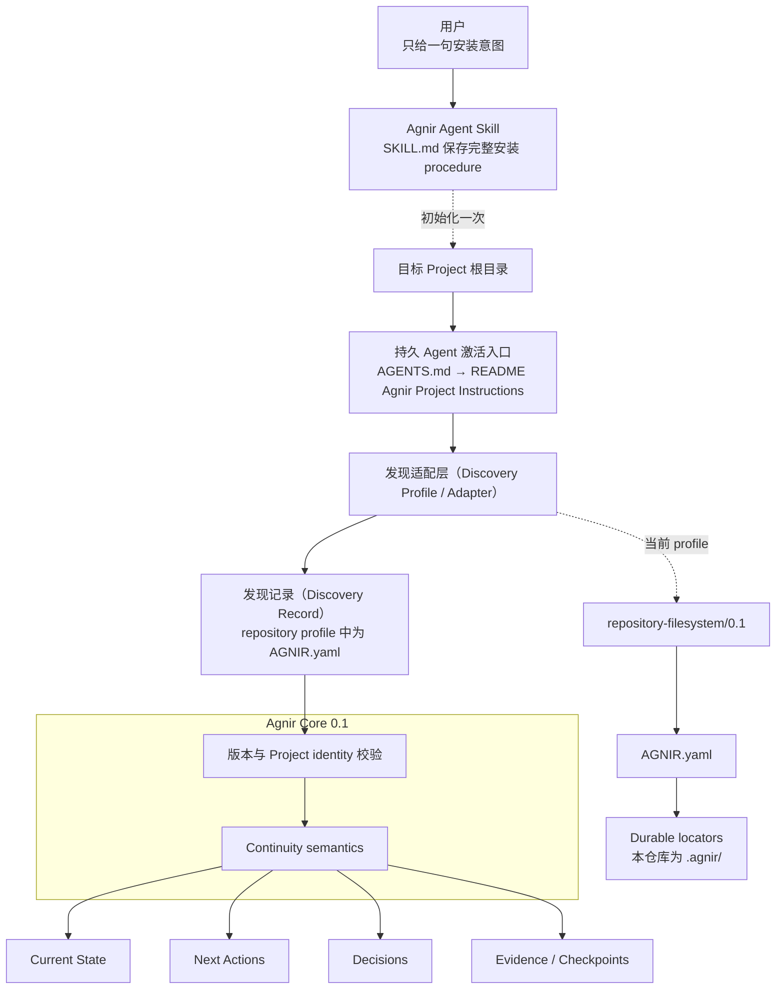
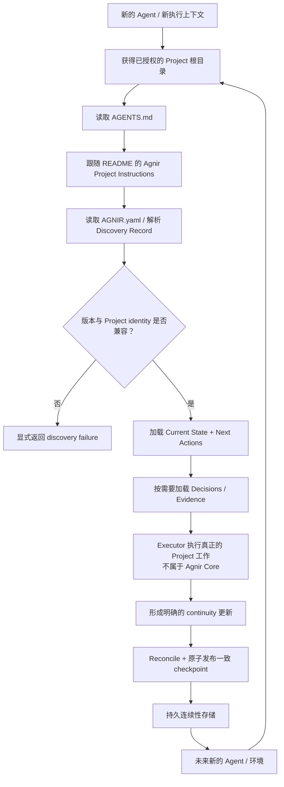

# Agnir

[English](README.md) | **简体中文**

Agnir 是一个 **由 Project 自己拥有的持久连续性协议（durable continuity protocol）**。

它让 Project 在 Agent、对话、执行环境或存储实现发生变化后仍然可以安全恢复和继续。Durable continuity 属于 Project，而不属于某个 execution surface。

**名字。** `Agnir` 取自冰岛语 `agnir`，是 `ögn` 的主格复数，意为“一小点”或“微粒（particle）”。这个名字对应 Agnir 的模型：Project 的持久连续性由一颗颗可发现的 Project truth 组成——Current State、Next Actions、Decisions 和 Evidence；这些“微粒”组合起来，使新的 Executor 即使没有前任的私有上下文，也能重新理解并继续 Project。

## 从这里开始

本节只面向用户。找到你现在要做的事，把对应的一句话交给 Agent 即可。

### 在新 Project 安装 Agnir

```text
为这个 Project 安装并初始化 Agnir：https://github.com/iorLab/agnir
```

### 升级已经使用 Agnir 的 Project

```text
把这个 Project 的 Agnir 升级到最新稳定版：https://github.com/iorLab/agnir
```

### 继续正常工作

**不需要再给 Agent 任何 Agnir bootstrap 提示词。** 直接让 Agent 访问 Project，并提出真正要做的任务。

安装或升级时，Agent 应把根目录 [`SKILL.md`](SKILL.md) 当作 canonical procedure；用户不需要携带 Agnir 的内部 checklist。

初始化完成后，Agent-operable repository Project 会自己持久保存激活路径：

```text
Project 根目录
→ AGENTS.md
→ README.md / Agnir Project Instructions
→ AGNIR.yaml
→ durable memory
```

`latest stable` 只指已经正式发布的稳定 tag / release，不能把会移动的 `main` 分支当成 stable。兼容升级必须保留 Project identity 与 durable continuity；compatibility line 发生变化时应进入 migration，而不是静默改写。

## Agnir Project Instructions

> **本节供 Agent 使用。** 普通用户通常不需要阅读。

1. **Discover。** 把本仓库根目录视为已授权的 Project Entry Point。读取顶层 `AGNIR.yaml`，校验声明的 Agnir Core/profile compatibility 与 Project identity。
2. **Load。** 从声明的 durable memory 加载 Current State 与 Next Actions；当 Decisions 与 Evidence 会实质约束本次操作时再加载。除非有更新的 Principal 指令或直接观察到的当前 Project 事实覆盖，否则 durable Project truth 优先于聊天记录或 Agent 私有记忆。
3. **Work。** 真正的 Project 工作发生在 Agnir Core 之外。安装、升级或 repair 时，根目录 `SKILL.md` 是 canonical Agent-facing procedure。
4. **Checkpoint。** 在明确的 checkpoint、保存进度、结束工作或 repository commit boundary 上，只 reconcile 有实质变化的 continuity。Durable truth 未变化时做 no-op；发生变化时必须形成一致的 authoritative transition。若 authoritative base 已过期，返回 `AGNIR_CHECKPOINT_CONFLICT`，不得覆盖更新事实；发布后重新验证 fresh discovery。
5. **Commit / push。** 在 repository / VCS 上下文中，已授权的 `commit`、`提交`、`提交代码` 或同义请求表示先 checkpoint 再 commit，并优先把 Project + Agnir 变化放进同一个 revision。`commit and push`、`提交推送` 或同义请求再加 push 与 authoritative-ref verification。只是观察到外部 commit，只触发 checkpoint evaluation，不代表无条件写入 Agnir。

根目录 `AGENTS.md` 只负责把 Agent 引导到本节，不得成为第二份 Project state 或 Agnir procedure。Canonical activation route 为：

`Project root -> AGENTS.md -> README.md / Agnir Project Instructions -> AGNIR.yaml -> declared durable memory`

如果 activation locator、Project identity、必需 memory locator 或 compatibility 校验失败，应显式暴露 failure，或在获得授权时修复最早出错的层；不得凭空补 Project state，也不得静默退回聊天历史、兄弟仓库或 retired layout。

## 架构图（Architecture Diagram）



`SKILL.md` 是 Agent-facing packaging layer；`AGENTS.md → README` 是面向 Agent 的 repository activation convention。两者都不是 Agnir Core 的依赖。已经知道适用 profile 的 Executor / adapter 可以直接从 Project Entry Point / Discovery Record 开始。

Agnir Core **不要求** Git、GitHub、repository、ChatGPT、AI Agent、Skill system 或某种具体 storage backend。

## Skill 与用户提示词的边界

Agnir 明确把用户意图和 Agent procedure 分开：

- **给用户的请求**保持简短：安装、升级，或者直接提出真正的 Project 任务。
- **给 Agent 的 procedure**位于根目录 `SKILL.md`，完整负责 install / initialize / upgrade / resume / checkpoint / commit / push / repair。

Skill 是发行和操作入口，不改变 Agnir Core 语义。初始化完成后，目标 Project 已经通过自己的 `AGENTS.md → README → AGNIR.yaml` 路线做到 self-describing；以后正常工作不需要再打开 Skill 来提醒 Agent “这个 Project 使用 Agnir”。

对于 `repository-filesystem/0.1`，Skill 通常会建立或校验：

```text
Project/
├── AGENTS.md                 # 指向 README 中 canonical Agnir 指令
├── AGNIR.yaml                # repository/filesystem discovery anchor
├── README.md                 # 包含 ## Agnir Project Instructions
└── .agnir/
    ├── state.md
    ├── next-actions.md
    ├── decisions.md
    └── evidence/
```

规范性的初始化 / 激活要求由 [`profiles/REPOSITORY_FILESYSTEM.md`](profiles/REPOSITORY_FILESYSTEM.md) 定义；根目录 `SKILL.md` 是把这些要求交给 Agent 执行的 procedure。

## 连续性流程（Continuity Flow）

安装完成后，正常 Project continuity 不再依赖最初那句用户安装提示词，也不依赖初始化对话：



Agnir 不执行流程中间的 Project 工作。它负责让 continuity 持久、可发现、绑定到正确 Project，并让未来 Executor 可以安全恢复。Not-found、ambiguity、unsupported version、Project mismatch、authorization failure、cycle、stale locator、material inconsistency 等 failure 都必须显式暴露，不能靠猜测静默修复。

## 当前版本线

`main` 是 Agnir `0.1.0` 稳定发布线。兼容标识分别为 Core `0.1` 和 `repository-filesystem/0.1`；仓库 SemVer 独立记录在 `VERSION`。

PPMP / PPM / Sandminni 等前身材料只属于 `history/` 与 immutable Git history，不属于当前兼容契约。

## 发布状态

Agnir `v0.1.0` 已经正式发布，是当前稳定的 repository release。Immutable `v0.1.0` tag 直接指向经过完整验证的 publication candidate `2a0cb7bf2068b11f361e315670b2f2dc497b2588`；之后 `main` 上的 checkpoint 不会重新定义这个 release target。`RELEASE.md` 定义版本模型、发布范围、发布门槛和已知限制。

三个版本层必须区分：

- Core compatibility：`0.1`；
- repository/filesystem profile：`repository-filesystem/0.1`；
- repository release：`0.1.0`。

## 仓库结构

```text
agnir/
├── spec/                              # 当前协议层定义
│   ├── AGNIR_CORE.md                  # Core 0.1，含 transactional checkpoint 语义
│   └── AGNIR_DISCOVERY.md             # discovery / Locator Chain / failures
├── profiles/
│   └── REPOSITORY_FILESYSTEM.md       # repository-filesystem/0.1 activation/init + VCS event integration
├── schemas/
│   └── agnir-manifest.schema.json     # AGNIR.yaml schema
├── conformance/
│   ├── check_agnir_0_1.py             # self-host + release-readiness
│   ├── activation_reference.py        # AGENTS → README activation resolver
│   ├── checkpoint_reference.py        # atomic/no-op/conflict checkpoint reference model
│   ├── test_skill_package.py          # Skill / 用户提示词边界 + commit intent 测试
│   └── test_*.py                      # 其他 executable conformance
├── .agnir/                            # 本 Project 的 canonical durable continuity
├── history/                           # 仅历史 lineage
├── .github/workflows/                 # CI
├── SKILL.md                           # canonical Agent-facing Agnir Skill procedure
├── AGENTS.md                          # 指向 README canonical Project instructions
├── AGNIR.yaml                         # repository/filesystem discovery anchor
├── RELEASE.md
├── README.md
├── README.zh-CN.md
└── VERSION                            # 0.1.0
```

需要查看完整 tracked file 级目录树，请看 **[REPOSITORY_TREE.md](REPOSITORY_TREE.md)**。

## Core memory semantics

Agnir 要求能够持久恢复 Current State、Next Actions、Decisions 和 Evidence / Checkpoints。Fresh compatible Executor 必须能够恢复继续 Project 所需的 truth，而不依赖上一段私有对话上下文。

## 与 Svif 的关系

Svif 是独立的 **Project orchestration product**，位于 `iorLab/svif`。当前 Svif 通过 Agnir adapter 使用 Agnir 作为首个 Continuity Provider；Agnir 不依赖 Svif，也可以独立使用。

## 文档同步规则

`README.md` 与 `README.zh-CN.md` 是并行入口。Layer model、Skill / install 边界、activation path、discovery path、durable-memory semantics、Project boundary 或 continuity flow 变化时，必须在同一个 change set 同步更新两种语言中受影响的说明 / 图。

在架构图之前，README 只保留简短的 Project 身份 / 名称解释，以及两类操作读者所需内容：**从这里开始**面向用户，**Agnir Project Instructions** 面向 Agent。安装与升级提示词都保持一句话；packaging、compatibility rationale、publication detail 与实现说明应放到架构入口之后或专门文档中。

`REPOSITORY_TREE.md` 是完整结构地图；它说明 evidence 目录职责，不再重复登记每一个 checkpoint evidence 文件名。

## Conformance

运行：

```bash
python conformance/check_agnir_0_1.py
python -m unittest discover -s conformance -p 'test_*.py' -v
```

`0.1.0` suite 覆盖 Agent Skill packaging、免重复提示的 Project activation、repository/filesystem discovery 与 failures、checkpoint atomic/no-op/conflict 语义、SQLite 非 repository continuity、external-memory authorization、multi-project isolation、Locator Chain failures、symlink boundaries 和真实 Git worktree cold start。

真实 mount-boundary 仍明确未验证；普通目录不能冒充 mount evidence。