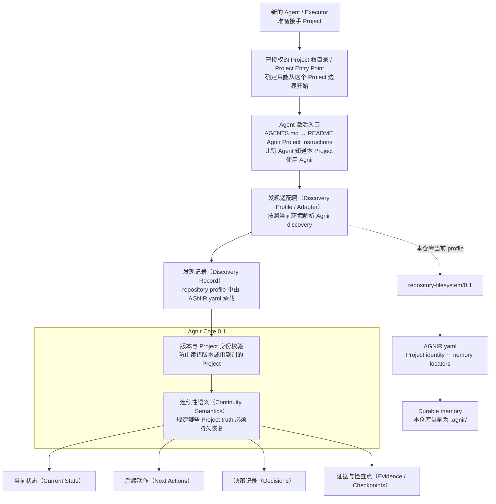
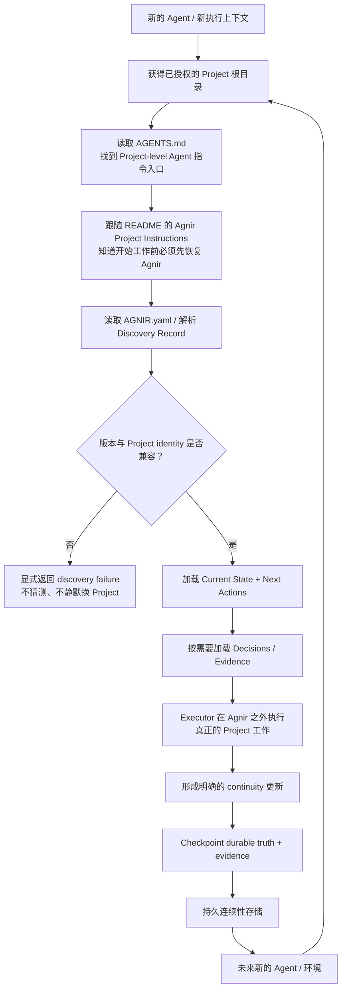

# Agnir

[English](README.md) | **简体中文**

Agnir 是一个 **由 Project 自己拥有的 durable continuity protocol（持久连续性协议）**。

它的目标是：即使 Executor、执行环境、存储实现或对话上下文发生变化，一个 Project 仍然可以被安全恢复和继续。Durable continuity 属于 Project，而不属于某个 execution surface。

## 30 秒快速开始

如果你的 Agent 能读写 Project 目录，`repository-filesystem/0.1` **不要求**安装后台服务、注册账号、接入 GitHub、使用 ChatGPT，也不要求某一种特定执行环境。

### 已经初始化 Agnir 的 Project

**不需要每次再给 Agent 一段 Agnir 提示词。** 一个正确初始化、面向 Agent 使用的 Project，会把“如何激活 Agnir”本身持久保存在 Project 里：

```text
Project 根目录
→ AGENTS.md
→ README.md / Agnir Project Instructions
→ AGNIR.yaml
→ durable memory
```

把 Project 正常交给 Agent，直接开始真正的任务即可。若某个 execution surface 不会自动读取 `AGENTS.md` 或 Project 文档，应当对该 execution surface 做一次性的 Project-instructions 配置；不应该让用户在每次新会话里重复粘贴 Agnir bootstrap 提示词。

### 给新 Project 初始化 Agnir

初始化提示词必须是**自包含**的，因为执行初始化的 Agent 可能从未听说过 Agnir。可以直接粘贴下面这段：

```text
Agnir 是一种由 Project 自己拥有的持久连续性协议：为了让 Project 在 Agent、对话、执行环境或存储实现变化后仍能安全继续，继续工作所必需的 Project 状态必须被持久保存，并且未来 Agent 必须能从 Project 本身发现这些状态以及读取它们的方法。

请为这个 Project 初始化 Agnir Core 0.1，使用 repository-filesystem/0.1。

要求：
1. 把当前 Project 根目录视为已授权的 Project Entry Point。
2. 创建或校验顶层 AGNIR.yaml：agnir.version 为 "0.1"，discovery_profile 为 "repository-filesystem/0.1"，设置持久的 project.identity，并为 Current State、Next Actions、Decisions、Evidence 声明 locator。除非 Project 已有经过明确设计的兼容布局，否则使用 .agnir/state.md、.agnir/next-actions.md、.agnir/decisions.md、.agnir/evidence/。
3. 创建这些 durable memory，写入最小当前内容，并至少持久保存一份 initialization evidence。
4. 在 Project 的 README.md 中创建或更新一个标题必须为 "## Agnir Project Instructions" 的 canonical section。它必须告诉未来 Agent：开始 Project 工作前，把 Project 根目录视为已授权 Project Entry Point；读取 AGNIR.yaml；加载 Current State 和 Next Actions；需要时加载 Decisions 和 Evidence；除非有更新的 Principal 指令或直接观察到的当前 Project 事实覆盖，否则以 Agnir durable Project truth 优先于聊天记录或 Agent 私有记忆；保存进度、checkpoint 或结束工作时，把重要变化写回 Agnir。
5. 创建或更新根目录 AGENTS.md，让它引用 README.md 的 "Agnir Project Instructions" section。AGENTS.md 只做 locator，不要复制完整 Agnir 规则。保留 README.md 与 AGENTS.md 中无关的现有内容，不要破坏性覆盖。
6. 最后做一次 fresh-agent 验证，只从 Project 根目录开始：AGENTS.md → README.md 的 Agnir Project Instructions → AGNIR.yaml → declared durable memory。确认今后继续 Project 不再依赖这次初始化对话或当前 Agent 的私有记忆。
```

最小的 `AGNIR.yaml` 可以这样写：

```yaml
agnir:
  version: "0.1"
  discovery_profile: "repository-filesystem/0.1"

project:
  identity: "urn:example:project:my-project"

memory:
  state: ".agnir/state.md"
  next_actions: ".agnir/next-actions.md"
  decisions: ".agnir/decisions.md"
  evidence: ".agnir/evidence/"

policy:
  checkpoint: event-driven
```

配套目录可以很简单：

```text
.agnir/
├── state.md              # 当前可靠状态：以后继续工作必须知道什么
├── next-actions.md       # 尚未完成的工作、优先级和 blocker
├── decisions.md          # 已接受的持久决策及必要理由
└── evidence/
    └── initialization.md # 第一份持久保存的初始化 evidence
```

关键不是文件数量，而是做到：**只初始化一次，以后无需重新向 Agent 解释 Agnir。** 如果 durable memory 保存了，但未来 Agent 不知道自己应该读取它，那么 continuity 仍然是不完整的。

## Agnir Project Instructions

本仓库自己也使用 Agnir 保存 durable Project continuity。

开始任何 Project 工作前，把本仓库根目录视为已授权的 Project Entry Point。先读取顶层 `AGNIR.yaml`，然后加载 Current State 和 Next Actions；需要时再加载 Decisions 和 Evidence。除非有更新的 Principal 指令或直接观察到的当前 Project 事实覆盖，否则 Agnir 中持久保存的 Project truth 优先于聊天记录或 Agent 私有记忆。

当进行 checkpoint、保存进度或结束工作时，把重要的状态、后续动作、决策和必要 evidence 写回 `AGNIR.yaml` 声明的位置。初始化或修复 discovery 后，应再次验证从同一个 Project Entry Point 可以 cold-start。

根目录 `AGENTS.md` 故意只做 locator，指向本 section；本 section 才是 canonical activation instruction。

## 架构图（Architecture Diagram）



`AGENTS.md → README` 是 Agent-operable repository 的 profile-level activation convention，不是 Agnir Core 的依赖。已经知道当前 Project 使用哪个 Agnir profile 的非 Agent Executor / adapter，可以直接从 `AGNIR.yaml` 开始 discovery。

Agnir Core 定义 durable continuity 的语义和 discovery invariants；它**不要求** Git、GitHub、repository、ChatGPT、AI Agent 或任何特定 storage backend。Profiles/adapters 负责在具体 Project Entry Point 和存储环境中实现这些语义。

对本仓库而言，当前 realization 是 `repository-filesystem/0.1`：通用 Agent 先通过 Project 自己持久保存的 instruction route 激活 Agnir，然后解析顶层 `AGNIR.yaml`，校验 Project identity 和 Agnir 版本线，再根据 manifest 中声明的 memory locators 找到持久状态。`AGENTS.md`、`README.md`、`AGNIR.yaml` 和 `.agnir/` 都是 profile/repository 层的选择，不是 Agnir Core 的普遍要求。

## 连续性流程（Continuity Flow）



Agnir 不执行流程中间的 Project 工作。它负责让 continuity 持久、可发现、绑定到正确 Project；对于面向 Agent 的 repository Project，还要让“应该先恢复 Agnir”这条入口本身也持久化。Not-found、ambiguity、unsupported version、Project mismatch、authorization failure、cycle、stale locator 和 material inconsistency 等 discovery failures 都必须显式暴露，不能通过猜测静默修复。

## 当前版本线

`main` 是 Agnir `0.1.0` 稳定发布线。协议兼容标识分别是 Core `0.1` 和 `repository-filesystem/0.1`；仓库 SemVer 独立记录在 `VERSION`。

PPMP v2.0.0 / Persistent Project Memory / Sandminni 等前身历史只通过 immutable commit SHA 与 `history/` 文档保存。当前协议不依赖 live legacy branch，也不定义 predecessor bootstrap fallback。

## 发布状态

当前仓库正在完成 Agnir `0.1.0` 发布前最后收口。`RELEASE.md` 固定版本模型、发布范围、发布门槛和已知限制。创建 `v0.1.0` Git tag 或 GitHub Release 仍然是单独的正式发布动作。

三个版本层必须区分：

- Core compatibility：`0.1`；
- repository/filesystem profile compatibility：`repository-filesystem/0.1`；
- repository release：`0.1.0`。

## 仓库结构

下面这棵树是仓库的实用导航：

```text
agnir/
├── spec/                              # 当前有效的协议层定义；不绑定具体 storage / execution surface
│   ├── AGNIR_CORE.md                  # 稳定 Core 0.1 continuity 语义和 invariants
│   └── AGNIR_DISCOVERY.md             # cold start、Locator Chain、identity、failure semantics
│
├── profiles/
│   └── REPOSITORY_FILESYSTEM.md       # repository-filesystem/0.1 + Agent activation / initialization contract
├── schemas/
│   └── agnir-manifest.schema.json     # AGNIR.yaml 的机器可读 schema
│
├── conformance/
│   ├── check_agnir_0_1.py             # self-hosting cold start + release-readiness 检查
│   ├── activation_reference.py        # AGENTS → README 激活路径的 conformance-only resolver
│   ├── *_reference.py                 # 其他 conformance-only reference models
│   └── test_*.py                      # activation / failure / backend / isolation / boundary fixtures
│
├── .agnir/                            # 本 Project 自己的 canonical durable continuity
│   ├── state.md
│   ├── next-actions.md
│   ├── decisions.md
│   └── evidence/
│
├── history/                           # 前身 lineage 与可选历史指南；不属于 active Core
│   ├── PREDECESSOR.md
│   ├── MIGRATION_PPMP_V2.md
│   └── BRANCH_ARCHIVE.md
├── .github/workflows/
├── AGENTS.md                          # Agent-facing locator；指向 README canonical Agnir 指令
├── AGNIR.yaml                         # repository-filesystem discovery anchor
├── RELEASE.md
├── README.md                          # 英文入口 + 本仓库 canonical Agnir activation instruction
├── README.zh-CN.md                    # 简体中文入口
└── VERSION                            # 当前 0.1.0
```

需要查看当前 `main` 的完整文件级展开，请看 **[完整目录树：REPOSITORY_TREE.md](REPOSITORY_TREE.md)**。

前身版本中的 implementation/backend/adapter/site/template material 不再留在 active `main`；需要时通过 `history/` 和 Git history 回溯。`history/` 只保存历史/参考资料，不定义当前 Agnir Core 行为。

## Core memory semantics

Agnir 要求能够持久恢复 Current State、Next Actions、Decisions 和 Evidence / Checkpoints。

Fresh Executor 只拿到 authorized Project Entry Point 和适用 profile/adapter implementation 时，必须能够找到 Discovery Record 和所需 durable state，而不依赖之前对话中的私有上下文。对于本来并不知道 Agnir 存在的通用 Agent，repository activation route 负责持久提供“先恢复 Agnir”这一入口。

## 与 Svif 的关系

Svif 是位于 `iorLab/svif` 的独立 **Project orchestration product**。当前 Svif 通过 Agnir adapter，把 Agnir 作为首个 Continuity Provider；但 Agnir 不依赖 Svif，也可以被其他产品或 Executor 独立使用。Svif 的 execution、delivery、provider、authority、distribution 等产品语义不属于 Agnir Core。

## 文档同步规则

`README.md` 与 `README.zh-CN.md` 是并行维护的项目入口。当 Agnir 的 layer model、activation path、discovery path、durable-memory semantics、Project boundary 或 continuity flow 发生变化时，**同一个 change set 必须同步更新两种语言 README 中受影响的架构图/流程图**。

README 必须把可操作的 Quick Start 放在架构材料之前。对于面向 Agent 的 repository 初始化，README 还必须说明持久 activation route 和自包含初始化 contract。纯文本仓库结构树继续作为快速导航；完整文件级结构由 `REPOSITORY_TREE.md` 维护。

## Conformance

运行 self-hosting 结构检查和完整 executable conformance：

```bash
python conformance/check_agnir_0_1.py
python -m unittest discover -s conformance -p 'test_*.py' -v
```

稳定 `0.1.0` 测试覆盖：repository profile 的无重复提示 Agent activation、repository/filesystem cold start 与显式 discovery failures、非 repository SQLite realization、external-memory authorization、多 Project isolation、Locator Chain cycle/stale/inconsistency、symlink 边界，以及真实 Git worktree cold start。

真实 mount boundary 目前仍明确属于**未证明**项；只有在真实 mount-capable 环境中验证后才能声称覆盖，不能拿普通目录模拟。这个限制记录在 `RELEASE.md`。
